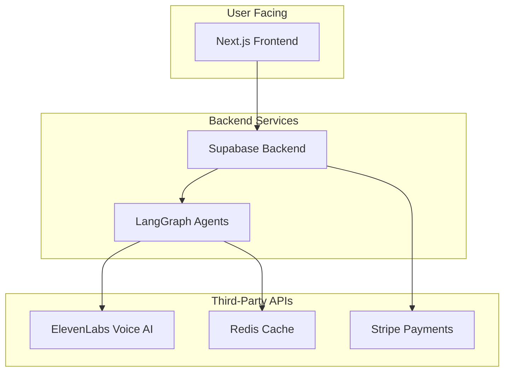

# PrepTalk - Overall Product Requirements Document

**Version:** 1.0  
**Date:** September 2025  
**Status:** `Draft`

---

## Table of Contents
1. [Executive Summary](#1-executive-summary)
2. [Product Vision](#2-product-vision)
3. [User Personas](#3-user-personas)
4. [Complete User Journey](#4-complete-user-journey)
5. [Feature Specifications](#5-feature-specifications)
6. [Technical Architecture](#6-technical-architecture)
7. [Business Model](#7-business-model)
8. [Success Metrics](#8-success-metrics)
9. [Risk Analysis](#9-risk-analysis)
10. [Implementation Roadmap](#10-implementation-roadmap)

---

## 1. Executive Summary

> PrepTalk is an AI-powered interview preparation platform that creates personalized interview curricula and conducts realistic voice-based mock interviews with real-time feedback.

### Key Differentiators
- **Hyper-Personalized**: Specific to exact company + role combination.
- **Voice-First**: Natural conversation with ElevenLabs AI agents.
- **Intelligent Feedback**: Transcript analysis with specific examples.
- **Reusable Intelligence**: Crowdsourced insights improve over time.

### Target Market
- **Primary**: Job seekers preparing for specific interviews.
- **Secondary**: Career coaches and bootcamps.
- **Tertiary**: HR departments for candidate preparation.

---

## 2. Product Vision

### Mission Statement
> "Democratize interview success by providing every job seeker with personalized, AI-powered interview coaching that adapts to their specific target role and company."

### 3-Year Vision
- 1M+ users prepared
- 500K+ company/role combinations
- 80% user success rate improvement
- Industry standard for interview prep

### Core Values
1. **Accessibility**: Affordable for all job seekers.
2. **Authenticity**: Real interview scenarios, not generic.
3. **Actionability**: Specific, implementable feedback.
4. **Privacy**: Secure handling of sensitive career data.

---

## 3. User Personas

### Primary Persona: "Sarah the Switcher"
- **Age**: 28-35
- **Context**: Switching careers or companies.
- **Pain Points**: 
  - Doesn't know what to expect in interviews.
  - Generic prep doesn't match actual interviews.
  - No feedback on practice attempts.
- **Goals**: 
  - Feel confident in interviews.
  - Know company-specific expectations.
  - Get the job offer.

### Secondary Persona: "David the Developer"
- **Age**: 22-30
- **Context**: Technical role preparation.
- **Pain Points**:
  - Leetcode doesn't cover system design.
  - Behavioral questions are unexpected.
  - No practice with verbal communication.
- **Goals**:
  - Balance technical and soft skills.
  - Practice explaining complex concepts.
  - Understand company's tech culture.

### Tertiary Persona: "Marcus the Manager"
- **Age**: 35-45
- **Context**: Senior/leadership roles.
- **Pain Points**:
  - Executive interviews are unstructured.
  - Need to demonstrate strategic thinking.
  - Cultural fit is crucial but nebulous.
- **Goals**:
  - Practice executive presence.
  - Prepare compelling vision stories.
  - Navigate political questions.

---

## 4. Complete User Journey

### Stage 1: Discovery (0-2 minutes)
- **Entry Points**:
    - Google search: "Amazon SDE interview prep"
    - LinkedIn ad targeting job seekers
    - Referral from friend
- **Landing Page**:
    - **Hero**: "Ace Your [Company] Interview with AI Mock Interviews"
    - **Search bar**: "Paste job URL or type Company + Role"
    - **Social proof**: "10,000+ successful interviews"
    - **Trust signals**: Security badges, testimonials

### Stage 2: Job Input & Research (2-5 minutes)
- **User Actions**:
    - Enters job URL or Company + Role.
    - Sees loading state: "Researching Amazon SDE III role..."
- **System Actions**:
    - Check cache for existing research.
    - If new, trigger research pipeline:
        - Scrape job posting
        - Gather company intelligence
        - Analyze role requirements
        - Find interview patterns
    - Show progress: "Found 47 interview experiences for this role"

### Stage 3: Curriculum Generation (5-7 minutes)
- **Transition**:
    - "Creating your personalized 5-round interview curriculum..."
    - Show what's being created (transparency).
- **Curriculum Creation**:
    - LangGraph agents collaborate.
    - Generate round-specific content.
    - Create evaluation criteria.
    - Prepare interviewer personas.

### Stage 4: User Onboarding (7-10 minutes)
- **Account Creation**:
    - Email/Google/LinkedIn signup.
    - Basic profile (name, experience level).
    - Optional: LinkedIn import for context.
- **Plan Selection**:
    - **Free**: 1 interview per month.
    - **Basic ($29/mo)**: 5 interviews per month.
    - **Premium ($79/mo)**: 20 interviews per month + bonus features.
    - Show value clearly.

### Stage 5: Dashboard Experience (Ongoing)
```mermaid
graph TD
    subgraph Dashboard
        A["Welcome, Sarah!"]
        B["Credits: 4 remaining"]
        C["Amazon SDE III<br>Seattle, WA"]
        D["Your Interview Journey"]
        E["① Phone --> ② Tech --> ③ Behav --> ④ System --> ⑤ Final"] (old - do not use these names!)
        F["[Start Round 1] (1 credit)"]
        G["Smart Questions to Ask:"]
        H["• How does Amazon measure success...<br>• What's the team's approach to..."]
    end
    A --> B
    B --> C
    D --> E
    E --> F
    G --> H
```

### Stage 6: Interview Session (30 minutes per round)
- **Pre-Session**:
    - Credit confirmation (1 credit will be used).
    - Equipment check (mic, quiet space).
    - Round briefing (what to expect).
    - Mindset tips ("Take your time", "Ask clarifying questions").
    - Start button (requires user action for autoplay).
- **During Session**:
    - Natural voice conversation.
    - AI interviewer follows curriculum.
    - Adaptive follow-up questions.
    - Time awareness (natural closing).
    - Emergency pause/end option.
- **Post-Session**:
    - Credit deducted automatically.
    - "Great job! Analyzing your performance..."
    - Redirect to feedback page.

### Stage 7: Feedback & Learning (10-15 minutes)
- **Immediate Feedback**:
    - Overall score with context.
    - 3 key strengths with examples.
    - 3 improvement areas with examples.
    - Specific moments to review.
- **Detailed Analysis**:
    - Transcript with annotations.
    - Skill-by-skill breakdown.
    - Comparison to successful candidates.
    - Action items for improvement.
    - Resources for skill gaps.

### Stage 8: Iteration & Progress
- **Between Rounds**:
    - Email reminders to continue.
    - Tips based on last performance.
    - Confidence tracking.
    - Community insights unlocked.
- **Completion**:
    - Certificate of completion.
    - Strengths summary for interviews.
    - Common questions to expect.
    - Final confidence boosters.

---

## 5. Feature Specifications

### 5.1 Core Features (MVP)

#### Research Engine
- **Input**: Job URL or Company + Role text.
- **Output**: Structured job requirements, company context.
- **Cache**: Reuse research for same role (24hr TTL).
- **Fallback**: Manual entry if scraping fails.

#### Curriculum Generator
- **Input**: Job requirements, company data.
- **Process**: Multi-agent LangGraph collaboration.
- **Output**: 5-round structured curriculum.
- **Personalization**: Adapts to experience level.

#### Voice Interview System
- **Provider**: ElevenLabs Conversational AI.
- **Duration**: 30 minutes per round.
- **Recording**: Full session audio + transcript.
- **Interruption**: Natural conversation flow.

#### Performance Analyzer
- **Input**: Interview transcript + evaluation criteria.
- **Process**: LangGraph analysis agent.
- **Output**: Scored feedback with examples.
- **Timing**: < 30 seconds after interview.

### 5.2 Growth Features (Post-MVP)

#### Community Intelligence
- User-submitted interview experiences.
- Verified question banks.
- Success story sharing.
- Peer practice matching.

#### Advanced Preparation
- Resume tailoring suggestions.
- STAR story builder.
- Technical concept explanations.
- Mock presentations.

#### Enterprise Features
- Bulk licenses for bootcamps.
- Custom curricula for companies.
- Analytics dashboards.
- API access.

---

## 6. Technical Architecture

### 6.1 Tech Stack
- **Frontend**: Next.js 15 (App Router)
- **AI Orchestration**: LangGraph JS
- **Voice AI**: ElevenLabs Conversational AI
- **Database**: Supabase (PostgreSQL)
- **Auth**: Supabase Auth
- **Payments**: Stripe
- **Analytics**: PostHog
- **Monitoring**: Sentry
- **Deployment**: Vercel

### 6.2 System Architecture


### 6.3 Data Flow
User Input → Research Pipeline → Cache Layer → Curriculum Generation → Interview Session → Transcript Processing → Performance Analysis → Feedback Delivery → Progress Tracking

---

## 7. Business Model

### 7.1 Pricing Strategy

#### Freemium Tiers
- **FREE ($0/month)**
    - 1 interview per month
    - Basic feedback
    - View community insights
- **BASIC ($29/month)**
    - 5 interviews per month
    - Detailed feedback with examples
    - All 5 rounds per application
    - Email support
- **PREMIUM ($79/month)**
    - 20 interviews per month
    - Priority AI processing
    - Resume review included
    - Mock video interviews
    - 1-on-1 coach chat support
    - Bonus credit purchases available
- **ENTERPRISE (Custom)**
    - Unlimited interviews
    - Custom curricula
    - Admin dashboard
    - API access
    - Dedicated support

### 7.2 Revenue Projections
- **Year 1**: 1,000 paid users × $29 avg = $29K MRR
- **Year 2**: 10,000 paid users × $35 avg = $350K MRR
- **Year 3**: 50,000 paid users × $40 avg = $2M MRR

### 7.3 Cost Structure
- **Variable Costs (per interview session)**:
    - ElevenLabs API: $3.00 per interview
    - OpenAI/Claude API: $1.00 per interview
    - Supabase: $0.40 per interview
    - Stripe fees (allocated): $0.10 per interview
    - **Total**: ~$4.50 per interview session
- **Fixed Costs (monthly)**:
    - Vercel: $150
    - Monitoring/Analytics: $200
    - Other SaaS: $300
    - **Total**: ~$650

---

## 8. Success Metrics

### 8.1 North Star Metric
**Interview Success Rate**: % of users who get job offers.

### 8.2 Key Metrics

#### Acquisition
- Landing page conversion: >5%
- Signup completion: >60%
- Trial to paid: >15%

#### Activation
- Complete first interview: >70%
- View feedback: >90%
- Start second round: >60%

#### Retention
- Month 1 retention: >60%
- Month 3 retention: >40%
- Month 6 retention: >30%

#### Revenue
- MRR growth: 20% MoM
- CAC payback: <3 months
- LTV/CAC ratio: >3

#### Engagement
- Interviews per user: >3
- Feedback rating: >4.5/5
- Referral rate: >20%

---

## 9. Risk Analysis

### 9.1 Technical Risks

| Risk                   | Probability | Impact | Mitigation                       |
|------------------------|-------------|--------|----------------------------------|
| Voice AI hallucination | High        | High   | Strict prompting, fallback scripts |
| Scraping blocked       | Medium      | High   | Multiple sources, manual entry   |
| High API costs         | High        | High   | Usage limits, efficient caching  |
| Transcript errors      | Medium      | Medium | Post-processing, user corrections|
| Scaling issues         | Low         | High   | Serverless architecture, CDN     |

### 9.2 Business Risks

| Risk                   | Probability | Impact | Mitigation                       |
|------------------------|-------------|--------|----------------------------------|
| Low completion rates   | High        | High   | Shorter sessions, save progress  |
| Competitor copying     | High        | Low    | Network effects, data moat       |
| Platform dependency    | Medium      | High   | Multi-provider strategy          |
| Legal (data privacy)   | Low         | High   | Clear policies, compliance       |
| Market downturn        | Low         | Medium | B2B pivot ready                  |

### 9.3 User Experience Risks

| Risk                     | Probability | Impact | Mitigation                       |
|--------------------------|-------------|--------|----------------------------------|
| Interview anxiety        | Medium      | Medium | Practice mode, gentle onboarding |
| Unrealistic expectations | High        | Medium | Clear value prop, testimonials   |
| Technical difficulties   | Medium      | High   | Thorough testing, fallbacks      |
| Generic feedback         | Medium      | High   | Specific examples required       |
| Credit confusion         | Medium      | Medium | Clear credit display, tutorials  |
| Credit depletion worry   | High        | Medium | Bonus credit options, clear pricing |

---

## 10. Implementation Roadmap

### 10.1 Phase 1: Foundation (Weeks 1-2)
- **Week 1**:
    - Database schema implementation
    - Basic Next.js setup
    - Authentication flow
    - Simple job input form
- **Week 2**:
    - Research pipeline (scraping)
    - Caching layer
    - Basic curriculum structure
    - Database integration
- **Deliverable**: Can input job and see basic curriculum.

### 10.2 Phase 2: Core Loop (Weeks 3-4)
- **Week 3**:
    - LangGraph curriculum agent
    - ElevenLabs integration
    - Voice interview MVP
    - Basic transcript capture
- **Week 4**:
    - Performance analyzer agent
    - Feedback generation
    - Results display
    - Progress tracking
- **Deliverable**: Complete interview + feedback loop.

### 10.3 Phase 3: Polish (Weeks 5-6)
- **Week 5**:
    - Payment integration
    - Subscription management
    - Email notifications
    - Dashboard improvements
- **Week 6**:
    - Performance optimization
    - Error handling
    - Analytics integration
    - Beta user testing
- **Deliverable**: Production-ready MVP.

### 10.4 Phase 4: Launch (Weeks 7-8)
- **Week 7**:
    - Security audit
    - Load testing
    - Documentation
    - Marketing site
- **Week 8**:
    - Beta launch (100 users)
    - Feedback collection
    - Bug fixes
    - Iterate