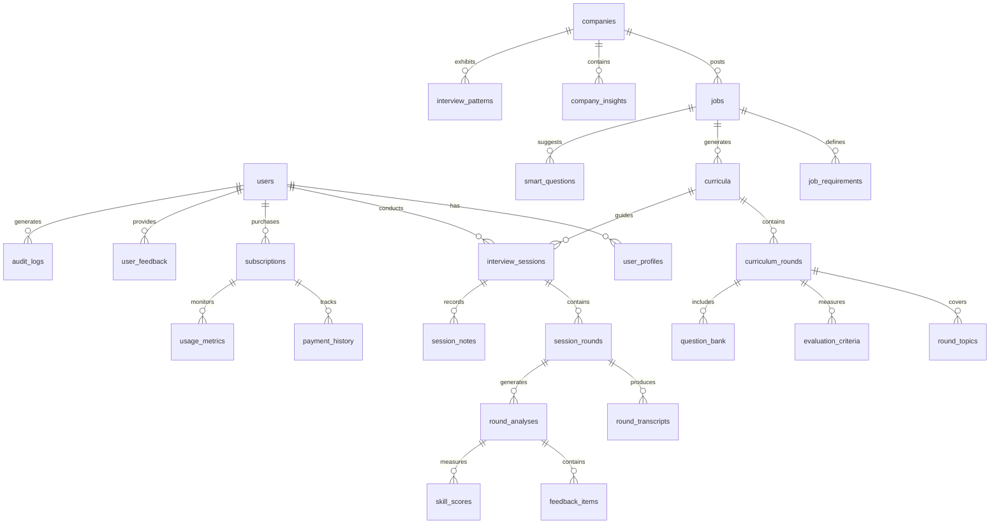

# PrepTalk - Database Schema & ERD

**Version:** 1.0  
**Date:** September 2025  
**Status:** `Implementation Ready`

---

## Table of Contents
1. [Database Strategy](#1-database-strategy)
2. [Entity Relationship Diagram](#2-entity-relationship-diagram)
3. [Table Definitions](#3-table-definitions)
4. [Indexes & Performance](#4-indexes--performance)
5. [Row Level Security](#5-row-level-security)
6. [Migration Strategy](#6-migration-strategy)
7. [Data Integrity Rules](#7-data-integrity-rules)
8. [Backup & Recovery](#8-backup--recovery)

---

## 1. Database Strategy

### 1.1 Design Principles
- **Normalization**: 3NF for transactional data.
- **Denormalization**: Strategic for read-heavy operations.
- **JSONB Usage**: Variable schema data (AI responses).
- **Soft Deletes**: Maintain data history.
- **Audit Trail**: Complete activity tracking.
- **Version Control**: Curriculum and content versioning.

### 1.2 Performance Strategy
- **Caching**: Redis for hot data (active curricula).
- **Partitioning**: Time-based for transcripts.
- **Archival**: S3 for old transcripts (>90 days).
- **Read Replicas**: For analytics queries.
- **Connection Pooling**: Supabase pgBouncer.

### 1.3 Scalability Targets
- 100K users
- 1M interview sessions (credit-based tracking)
- 10M feedback items
- 100GB total storage
- <100ms query response
- 10M credit transactions per month

---

## 2. Entity Relationship Diagram


---

## 3. Table Definitions

### 3.1 User Domain

<details>
<summary>USERS (Managed by Supabase Auth)</summary>

```sql
-- ============================================
-- USERS (Managed by Supabase Auth)
-- ============================================
CREATE TABLE auth.users (
    id UUID PRIMARY KEY DEFAULT gen_random_uuid(),
    email TEXT UNIQUE NOT NULL,
    encrypted_password TEXT,
    email_confirmed_at TIMESTAMPTZ,
    created_at TIMESTAMPTZ DEFAULT NOW(),
    updated_at TIMESTAMPTZ DEFAULT NOW()
);
```
</details>

<details>
<summary>USER PROFILES</summary>

```sql
-- ============================================
-- USER PROFILES
-- ============================================
CREATE TABLE public.user_profiles (
    id UUID PRIMARY KEY DEFAULT gen_random_uuid(),
    user_id UUID NOT NULL REFERENCES auth.users(id) ON DELETE CASCADE,
    
    -- Basic Information
    full_name TEXT,
    avatar_url TEXT,
    phone_number TEXT,
    timezone TEXT DEFAULT 'UTC',
    
    -- Professional Information
    current_role TEXT,
    target_role TEXT,
    experience_level TEXT CHECK (
        experience_level IN ('entry', 'junior', 'mid', 'senior', 'lead', 'principal', 'executive')
    ),
    years_of_experience INTEGER,
    
    -- Documents
    resume_url TEXT,
    linkedin_url TEXT,
    github_url TEXT,
    portfolio_url TEXT,
    
    -- Preferences
    preferred_interview_style TEXT CHECK (
        preferred_interview_style IN ('conversational', 'formal', 'technical', 'behavioral')
    ),
    notification_preferences JSONB DEFAULT '{
        "email": {
            "session_complete": true,
            "weekly_progress": true,
            "new_features": false
        },
        "sms": {
            "session_reminder": false
        }
    }',
    
    -- Metadata
    onboarding_completed BOOLEAN DEFAULT false,
    is_active BOOLEAN DEFAULT true,
    last_active_at TIMESTAMPTZ,
    created_at TIMESTAMPTZ DEFAULT NOW(),
    updated_at TIMESTAMPTZ DEFAULT NOW(),
    
    CONSTRAINT unique_user_profile UNIQUE(user_id)
);

-- Indexes
CREATE INDEX idx_user_profiles_user_id ON user_profiles(user_id);
CREATE INDEX idx_user_profiles_active ON user_profiles(is_active, last_active_at DESC);
```
</details>

<details>
<summary>SUBSCRIPTIONS</summary>

```sql
-- ============================================
-- SUBSCRIPTIONS
-- ============================================
CREATE TABLE public.subscriptions (
    id UUID PRIMARY KEY DEFAULT gen_random_uuid(),
    user_id UUID NOT NULL REFERENCES auth.users(id) ON DELETE CASCADE,
    
    -- Stripe Integration
    stripe_customer_id TEXT UNIQUE,
    stripe_subscription_id TEXT UNIQUE,
    stripe_price_id TEXT,
    
    -- Plan Details
    plan_type TEXT NOT NULL CHECK (
        plan_type IN ('free', 'basic', 'premium', 'enterprise')
    ),
    status TEXT NOT NULL CHECK (
        status IN ('trialing', 'active', 'canceled', 'incomplete', 'past_due', 'unpaid')
    ),
    
    -- Billing Period
    current_period_start TIMESTAMPTZ,
    current_period_end TIMESTAMPTZ,
    cancel_at TIMESTAMPTZ,
    canceled_at TIMESTAMPTZ,
    
    -- Usage Limits (Credit-based system)
    monthly_credits INTEGER DEFAULT 1,
    bonus_credits INTEGER DEFAULT 0, -- One-time purchases
    
        -- Features
    features JSONB DEFAULT '{
        "voice_interviews": false,
        "detailed_feedback": false,
        "resume_review": false,
        "priority_support": false,
        "api_access": false
    }',
    
    -- Metadata
    trial_start TIMESTAMPTZ,
    trial_end TIMESTAMPTZ,
    created_at TIMESTAMPTZ DEFAULT NOW(),
    updated_at TIMESTAMPTZ DEFAULT NOW(),
    
    CONSTRAINT unique_user_subscription UNIQUE(user_id)
);

-- Indexes
CREATE INDEX idx_subscriptions_user_id ON subscriptions(user_id);
CREATE INDEX idx_subscriptions_stripe_customer ON subscriptions(stripe_customer_id);
CREATE INDEX idx_subscriptions_status ON subscriptions(status, current_period_end);
```
</details>

<details>
<summary>USER CREDITS</summary>

```sql
-- ============================================
-- USER CREDITS
-- ============================================
CREATE TABLE public.user_credits (
    id UUID PRIMARY KEY DEFAULT gen_random_uuid(),
    user_id UUID NOT NULL REFERENCES auth.users(id) ON DELETE CASCADE,
    
    -- Current Balance
    monthly_credits INTEGER DEFAULT 0,
    bonus_credits INTEGER DEFAULT 0, -- From purchases, never reset
    
    -- Monthly Tracking
    credits_used_this_month INTEGER DEFAULT 0,
    current_period_start DATE DEFAULT CURRENT_DATE,
    current_period_end DATE DEFAULT (CURRENT_DATE + INTERVAL '1 month'),
    
    -- Metadata
    last_credit_used_at TIMESTAMPTZ,
    created_at TIMESTAMPTZ DEFAULT NOW(),
    updated_at TIMESTAMPTZ DEFAULT NOW(),
    
    CONSTRAINT unique_user_credits UNIQUE(user_id),
    CONSTRAINT check_credits_positive CHECK (monthly_credits >= 0 AND bonus_credits >= 0)
);

-- Indexes
CREATE INDEX idx_user_credits_user_id ON user_credits(user_id);
CREATE INDEX idx_user_credits_period ON user_credits(current_period_end);
```
</details>

<details>
<summary>CREDIT TRANSACTIONS</summary>

```sql
-- ============================================
-- CREDIT TRANSACTIONS
-- ============================================
CREATE TABLE public.credit_transactions (
    id UUID PRIMARY KEY DEFAULT gen_random_uuid(),
    user_id UUID NOT NULL REFERENCES auth.users(id) ON DELETE CASCADE,
    
    -- Transaction Details
    transaction_type TEXT NOT NULL CHECK (
        transaction_type IN ('earned', 'used', 'purchased', 'refunded', 'expired', 'reset')
    ),
    credit_type TEXT NOT NULL CHECK (
        credit_type IN ('monthly', 'bonus')
    ),
    amount INTEGER NOT NULL, -- Positive for gains, negative for usage
    
    -- Context
    description TEXT NOT NULL,
    related_entity_type TEXT, -- 'interview_session', 'curriculum', 'subscription'
    related_entity_id UUID,
    
    -- Stripe Integration (for purchases)
    stripe_payment_intent_id TEXT,
    
    -- Metadata
    created_at TIMESTAMPTZ DEFAULT NOW(),
    
    CONSTRAINT check_amount_not_zero CHECK (amount != 0)
);

-- Indexes
CREATE INDEX idx_credit_transactions_user ON credit_transactions(user_id, created_at DESC);
CREATE INDEX idx_credit_transactions_type ON credit_transactions(transaction_type);
CREATE INDEX idx_credit_transactions_entity ON credit_transactions(related_entity_type, related_entity_id);
```
```
</details>

### 3.2 Company & Job Domain

<details>
<summary>COMPANIES</summary>

```sql
-- ============================================
-- COMPANIES
-- ============================================
CREATE TABLE public.companies (
    id UUID PRIMARY KEY DEFAULT gen_random_uuid(),
    
    -- Basic Information
    name TEXT NOT NULL,
    display_name TEXT,
    domain TEXT,
    logo_url TEXT,
    
    -- Classification
    industry TEXT,
    sub_industry TEXT,
    company_size TEXT CHECK (
        company_size IN ('1-10', '11-50', '51-200', '201-500', '501-1000', '1001-5000', '5000+')
    ),
    company_type TEXT CHECK (
        company_type IN ('startup', 'scaleup', 'enterprise', 'agency', 'nonprofit', 'government')
    ),
    
    -- Location
    headquarters_location TEXT,
    locations JSONB DEFAULT '[]', -- Array of office locations
    remote_first BOOLEAN DEFAULT false,
    
    -- Cached Research (Expensive to compute)
    overview JSONB DEFAULT '{
        "mission": null,
        "vision": null,
        "values": [],
        "culture_notes": null
    }',
    recent_news JSONB DEFAULT '[]', -- Array of {title, url, date, summary}
    funding_info JSONB DEFAULT '{
        "stage": null,
        "total_raised": null,
        "last_round": null,
        "investors": []
    }',
    
    -- Interview Intelligence
    interview_process JSONB DEFAULT '{
        "typical_rounds": null,
        "average_duration_days": null,
        "common_interviewers": [],
        "red_flags": [],
        "green_flags": []
    }',
    
    -- Data Quality
    data_sources JSONB DEFAULT '[]', -- ['glassdoor', 'linkedin', 'website', 'user_contributed']
    confidence_score FLOAT DEFAULT 0.5 CHECK (confidence_score >= 0 AND confidence_score <= 1),
    verification_status TEXT DEFAULT 'unverified' CHECK (
        verification_status IN ('unverified', 'partially_verified', 'verified', 'official')
    ),
    
    -- Metadata
    last_scraped_at TIMESTAMPTZ,
    last_verified_at TIMESTAMPTZ,
    research_version INTEGER DEFAULT 1,
    created_at TIMESTAMPTZ DEFAULT NOW(),
    updated_at TIMESTAMPTZ DEFAULT NOW(),
    
    CONSTRAINT unique_company_domain UNIQUE(name, domain)
);

-- Indexes
CREATE INDEX idx_companies_name ON companies(name);
CREATE INDEX idx_companies_domain ON companies(domain);
CREATE INDEX idx_companies_industry ON companies(industry);
CREATE GIN INDEX idx_companies_locations ON companies(locations);
```
</details>

<details>
<summary>JOBS</summary>

```sql
-- ============================================
-- JOBS
-- ============================================
CREATE TABLE public.jobs (
    id UUID PRIMARY KEY DEFAULT gen_random_uuid(),
    company_id UUID NOT NULL REFERENCES companies(id) ON DELETE CASCADE,
    
    -- Job Identification
    title TEXT NOT NULL,
    normalized_title TEXT, -- Senior Software Engineer → senior_software_engineer
    department TEXT,
    team TEXT,
    
    -- Classification
    level TEXT CHECK (
        level IN ('intern', 'entry', 'junior', 'mid', 'senior', 'lead', 'principal', 'staff', 'executive')
    ),
    job_type TEXT CHECK (
        job_type IN ('full-time', 'part-time', 'contract', 'internship', 'freelance')
    ),
    work_arrangement TEXT CHECK (
        work_arrangement IN ('onsite', 'remote', 'hybrid')
    ),
    
    -- Location
    location TEXT,
    location_requirement TEXT, -- "Must be in PST timezone"
    
    -- Compensation (if available)
    salary_min INTEGER,
    salary_max INTEGER,
    salary_currency TEXT DEFAULT 'USD',
    equity_offered BOOLEAN,
    
    -- Source Information
    source_url TEXT,
    source_job_id TEXT, -- External ID from job board
    application_url TEXT,
    posted_date DATE,
    expiry_date DATE,
    
    -- Content
    raw_description TEXT, -- Original HTML/text
    parsed_description JSONB DEFAULT '{
        "responsibilities": [],
        "requirements": [],
        "nice_to_have": [],
        "benefits": [],
        "about_team": null
    }',
    
    -- Status
    is_active BOOLEAN DEFAULT true,
    application_count INTEGER DEFAULT 0, -- How many users applied
    
    -- Metadata
    last_checked_at TIMESTAMPTZ,
    created_at TIMESTAMPTZ DEFAULT NOW(),
    updated_at TIMESTAMPTZ DEFAULT NOW(),
    
    CONSTRAINT unique_job_posting UNIQUE(company_id, source_url)
);

-- Indexes
CREATE INDEX idx_jobs_company ON jobs(company_id);
CREATE INDEX idx_jobs_title ON jobs(normalized_title);
CREATE INDEX idx_jobs_active ON jobs(is_active, posted_date DESC);
CREATE INDEX idx_jobs_location ON jobs(location);
```
</details>

<details>
<summary>JOB REQUIREMENTS</summary>

```sql
-- ============================================
-- JOB REQUIREMENTS
-- ============================================
CREATE TABLE public.job_requirements (
    id UUID PRIMARY KEY DEFAULT gen_random_uuid(),
    job_id UUID NOT NULL REFERENCES jobs(id) ON DELETE CASCADE,
    
    -- Skills Breakdown
    technical_skills JSONB DEFAULT '[]', 
    /* [{
        "skill": "Python",
        "level": "expert",
        "years": 5,
        "required": true,
        "weight": 0.3
    }] */
    
    soft_skills JSONB DEFAULT '[]',
    /* [{
        "skill": "Leadership",
        "examples": ["team lead", "mentoring"],
        "required": false,
        "weight": 0.2
    }] */
    
    domain_knowledge JSONB DEFAULT '[]',
    /* [{
        "domain": "FinTech",
        "specific_areas": ["payments", "compliance"],
        "required": true
    }] */
    
    -- Experience Requirements
    minimum_years_experience INTEGER,
    preferred_years_experience INTEGER,
    
    -- Education
    education_level TEXT CHECK (
        education_level IN ('high_school', 'associate', 'bachelor', 'master', 'phd', 'none')
    ),
    preferred_majors TEXT[],
    
    -- Certifications
    required_certifications JSONB DEFAULT '[]',
    preferred_certifications JSONB DEFAULT '[]',
    
    -- Analysis Metadata
    extraction_confidence FLOAT DEFAULT 0.5,
    extraction_model TEXT,
    manual_review BOOLEAN DEFAULT false,
    
    created_at TIMESTAMPTZ DEFAULT NOW(),
    updated_at TIMESTAMPTZ DEFAULT NOW(),
    
    CONSTRAINT unique_job_requirements UNIQUE(job_id)
);

-- Indexes
CREATE INDEX idx_job_requirements_job ON job_requirements(job_id);
CREATE GIN INDEX idx_job_requirements_technical ON job_requirements(technical_skills);
```
</details>

### 3.3 Curriculum Domain

<details>
<summary>CURRICULA</summary>

```sql
-- ============================================
-- CURRICULA
-- ============================================
CREATE TABLE public.curricula (
    id UUID PRIMARY KEY DEFAULT gen_random_uuid(),
    job_id UUID NOT NULL REFERENCES jobs(id),
    
    -- Versioning
    version INTEGER DEFAULT 1,
    is_active BOOLEAN DEFAULT true,
    parent_curriculum_id UUID REFERENCES curricula(id), -- For version tracking
    
    -- Generation Details
    generation_model TEXT NOT NULL, -- 'gpt-4-turbo', 'claude-3'
    generation_params JSONB DEFAULT '{
        "temperature": 0.7,
        "strategy": "comprehensive"
    }',
    generation_cost_cents INTEGER,
    generation_duration_ms INTEGER,
    
    -- Curriculum Content
    title TEXT NOT NULL,
    overview TEXT,
    learning_objectives JSONB DEFAULT '[]',
    
    -- Structure
    total_rounds INTEGER DEFAULT 5,
    estimated_total_minutes INTEGER DEFAULT 150,
    difficulty_level TEXT CHECK (
        difficulty_level IN ('beginner', 'intermediate', 'advanced', 'expert')
    ),
    
    -- Customization
    experience_level_adjustments JSONB DEFAULT '{
        "entry": {"focus": "fundamentals", "depth": "basic"},
        "senior": {"focus": "architecture", "depth": "advanced"}
    }',
    
    -- Quality Metrics
    completeness_score FLOAT, -- How well it covers job requirements
    relevance_score FLOAT, -- How specific to company/role
    difficulty_score FLOAT, -- Appropriate challenge level
    
    -- Usage Metrics
    times_used INTEGER DEFAULT 0,
    avg_completion_rate FLOAT,
    avg_user_rating FLOAT,
    
    -- Metadata
    created_at TIMESTAMPTZ DEFAULT NOW(),
    updated_at TIMESTAMPTZ DEFAULT NOW(),
    expires_at TIMESTAMPTZ DEFAULT (NOW() + INTERVAL '30 days'),
    
    CONSTRAINT check_version CHECK (version > 0)
);

-- Indexes
CREATE INDEX idx_curricula_job_active ON curricula(job_id, is_active);
CREATE INDEX idx_curricula_created ON curricula(created_at DESC);
```
</details>

<details>
<summary>CURRICULUM ROUNDS</summary>

```sql
-- ============================================
-- CURRICULUM ROUNDS
-- ============================================
CREATE TABLE public.curriculum_rounds (
    id UUID PRIMARY KEY DEFAULT gen_random_uuid(),
    curriculum_id UUID NOT NULL REFERENCES curricula(id) ON DELETE CASCADE,
    
    -- Round Identity
    round_number INTEGER NOT NULL CHECK (round_number > 0),
    round_type TEXT NOT NULL CHECK (
        round_type IN (
            'phone_screen', 'technical_screen', 'coding', 'system_design',
            'behavioral', 'culture_fit', 'case_study', 'presentation', 'final'
        )
    ),
    
    -- Basic Information
    title TEXT NOT NULL,
    description TEXT,
    duration_minutes INTEGER DEFAULT 30,
    
    -- Interviewer Configuration
    interviewer_persona JSONB NOT NULL DEFAULT '{
        "name": "Alex Chen",
        "role": "Senior Engineer",
        "personality": "friendly but thorough",
        "communication_style": "direct",
        "pace": "moderate"
    }',
    
    -- Voice Configuration (ElevenLabs)
    voice_config JSONB DEFAULT '{
        "voice_id": null,
        "stability": 0.5,
        "similarity_boost": 0.75,
        "style": "professional"
    }',
    
    -- Interview Structure
    opening_script TEXT,
    closing_script TEXT,
    time_management JSONB DEFAULT '{
        "introduction": 2,
        "main_content": 25,
        "questions_from_candidate": 3
    }',
    
    -- Focus Areas
    topics_to_cover JSONB NOT NULL DEFAULT '[]',
    /* [{
        "topic": "Data Structures",
        "subtopics": ["arrays", "trees"],
        "depth": "intermediate",
        "time_allocation": 10,
        "must_cover": true
    }] */
    
    -- Evaluation
    evaluation_criteria JSONB NOT NULL DEFAULT '[]',
    /* [{
        "criterion": "Problem Solving",
        "description": "Ability to break down complex problems",
        "weight": 0.3,
        "scoring_rubric": {
            "excellent": "Systematic approach with optimization",
            "good": "Solid approach with minor gaps",
            "needs_improvement": "Struggled with problem decomposition"
        }
    }] */
    
    -- Success Metrics
    passing_score FLOAT DEFAULT 70.0,
    
    created_at TIMESTAMPTZ DEFAULT NOW(),
    updated_at TIMESTAMPTZ DEFAULT NOW(),
    
    CONSTRAINT unique_curriculum_round UNIQUE(curriculum_id, round_number)
);

-- Indexes
CREATE INDEX idx_curriculum_rounds_curriculum ON curriculum_rounds(curriculum_id, round_number);
```
</details>

<details>
<summary>QUESTION BANK</summary>

```sql
-- ============================================
-- QUESTION BANK
-- ============================================
CREATE TABLE public.question_bank (
    id UUID PRIMARY KEY DEFAULT gen_random_uuid(),
    curriculum_round_id UUID NOT NULL REFERENCES curriculum_rounds(id) ON DELETE CASCADE,
    
    -- Question Details
    question_text TEXT NOT NULL,
    question_type TEXT CHECK (
        question_type IN ('technical', 'behavioral', 'situational', 'case', 'trivia')
    ),
    
    -- Categorization
    category TEXT,
    difficulty TEXT CHECK (difficulty IN ('easy', 'medium', 'hard')),
    
    -- Usage Rules
    is_required BOOLEAN DEFAULT false,
    max_uses_per_session INTEGER, -- null = unlimited
    
    -- Follow-ups
    follow_up_questions JSONB DEFAULT '[]',
    expected_answer_points JSONB DEFAULT '[]',
    
    -- Scoring
    scoring_guide JSONB DEFAULT '{
        "excellent_indicators": [],
        "red_flags": [],
        "partial_credit": true
    }',
    
    created_at TIMESTAMPTZ DEFAULT NOW()
);

-- Indexes
CREATE INDEX idx_questions_round ON question_bank(curriculum_round_id);
CREATE INDEX idx_questions_type ON question_bank(question_type, difficulty);
```
</details>

### 3.4 Interview Session Domain

<details>
<summary>INTERVIEW SESSIONS</summary>

```sql
-- ============================================
-- INTERVIEW SESSIONS
-- ============================================
CREATE TABLE public.interview_sessions (
    id UUID PRIMARY KEY DEFAULT gen_random_uuid(),
    user_id UUID NOT NULL REFERENCES auth.users(id),
    curriculum_id UUID NOT NULL REFERENCES curricula(id),
    job_id UUID NOT NULL REFERENCES jobs(id),
    
    -- Session State
    status TEXT NOT NULL DEFAULT 'not_started' CHECK (
        status IN ('not_started', 'in_progress', 'completed', 'abandoned', 'expired')
    ),
    
    -- Timing
    scheduled_for TIMESTAMPTZ,
    started_at TIMESTAMPTZ,
    last_activity_at TIMESTAMPTZ,
    completed_at TIMESTAMPTZ,
    expires_at TIMESTAMPTZ DEFAULT (NOW() + INTERVAL '7 days'),
    
    -- Progress
    current_round INTEGER DEFAULT 1,
    rounds_completed INTEGER DEFAULT 0,
    rounds_skipped INTEGER DEFAULT 0,
    
    -- Time Tracking
    total_duration_seconds INTEGER DEFAULT 0,
    total_speaking_time_seconds INTEGER DEFAULT 0,
    total_thinking_time_seconds INTEGER DEFAULT 0,
    
    -- Overall Performance
    overall_score FLOAT,
    percentile_rank FLOAT, -- Compared to others for same job
    
    -- Aggregated Insights
    strengths JSONB DEFAULT '[]',
    weaknesses JSONB DEFAULT '[]',
    key_improvements JSONB DEFAULT '[]',
    
    -- Recommendation
    readiness_assessment TEXT CHECK (
        readiness_assessment IN ('ready', 'almost_ready', 'needs_practice', 'significant_gaps')
    ),
    recommended_focus_areas JSONB DEFAULT '[]',
    
    -- Metadata
    device_info JSONB, -- Browser, OS, connection quality
    session_quality_score FLOAT, -- Audio quality, interruptions
    
    created_at TIMESTAMPTZ DEFAULT NOW(),
    updated_at TIMESTAMPTZ DEFAULT NOW()
);

-- Indexes
CREATE INDEX idx_sessions_user ON interview_sessions(user_id, created_at DESC);
CREATE INDEX idx_sessions_status ON interview_sessions(status, expires_at);
CREATE INDEX idx_sessions_job ON interview_sessions(job_id);
```
</details>

<details>
<summary>SESSION ROUNDS</summary>

```sql
-- ============================================
-- SESSION ROUNDS
-- ============================================
CREATE TABLE public.session_rounds (
    id UUID PRIMARY KEY DEFAULT gen_random_uuid(),
    session_id UUID NOT NULL REFERENCES interview_sessions(id) ON DELETE CASCADE,
    curriculum_round_id UUID NOT NULL REFERENCES curriculum_rounds(id),
    
    -- Round Identity
    round_number INTEGER NOT NULL,
    attempt_number INTEGER DEFAULT 1, -- For retakes
    
    -- Status
    status TEXT NOT NULL DEFAULT 'not_started' CHECK (
        status IN ('not_started', 'ready', 'in_progress', 'completed', 'abandoned', 'error')
    ),
    
    -- Timing
    scheduled_start TIMESTAMPTZ,
    actual_start TIMESTAMPTZ,
    actual_end TIMESTAMPTZ,
    duration_seconds INTEGER,
    
    -- ElevenLabs Integration
    elevenlabs_session_id TEXT,
    elevenlabs_agent_id TEXT,
    elevenlabs_conversation_id TEXT,
    
    -- Recording
    recording_url TEXT,
    recording_duration_seconds INTEGER,
    recording_size_bytes INTEGER,
    
    -- Quality Metrics
    audio_quality_score FLOAT,
    network_stability_score FLOAT,
    interruption_count INTEGER DEFAULT 0,
    
    -- Quick Stats
    questions_asked INTEGER,
    questions_answered INTEGER,
    
    created_at TIMESTAMPTZ DEFAULT NOW(),
    updated_at TIMESTAMPTZ DEFAULT NOW(),
    
    CONSTRAINT unique_session_round UNIQUE(session_id, round_number, attempt_number)
);

-- Indexes
CREATE INDEX idx_session_rounds_session ON session_rounds(session_id, round_number);
CREATE INDEX idx_session_rounds_status ON session_rounds(status, created_at DESC);
```
</details>

<details>
<summary>ROUND TRANSCRIPTS</summary>

```sql
-- ============================================
-- ROUND TRANSCRIPTS
-- ============================================
CREATE TABLE public.round_transcripts (
    id UUID PRIMARY KEY DEFAULT gen_random_uuid(),
    session_round_id UUID NOT NULL REFERENCES session_rounds(id) ON DELETE CASCADE,
    
    -- Raw Content
    full_transcript TEXT,
    
    -- Structured Messages
    messages JSONB NOT NULL DEFAULT '[]',
    /* [{
        "speaker": "interviewer|candidate",
        "text": "...",
        "timestamp": "00:01:23",
        "confidence": 0.95,
        "sentiment": "positive",
        "is_question": false,
        "is_technical": true
    }] */
    
    -- Statistics
    total_words INTEGER,
    unique_words INTEGER,
    
    -- Speaking Metrics
    candidate_speaking_time_seconds INTEGER,
    interviewer_speaking_time_seconds INTEGER,
    silence_time_seconds INTEGER,
    overlap_time_seconds INTEGER,
    
    -- Communication Metrics
    filler_words_count INTEGER,
    filler_words JSONB DEFAULT '[]', -- ["um", "uh", "like"]
    
    speaking_pace_wpm FLOAT, -- Words per minute
    
    -- Behavioral Metrics
    interruption_count INTEGER DEFAULT 0,
    question_response_time_avg_seconds FLOAT,
    
    -- Processing
    transcription_provider TEXT DEFAULT 'elevenlabs', -- 'elevenlabs', 'whisper'
    processing_completed BOOLEAN DEFAULT false,
    processing_duration_ms INTEGER,
    
    created_at TIMESTAMPTZ DEFAULT NOW(),
    
    CONSTRAINT unique_round_transcript UNIQUE(session_round_id)
);

-- Indexes
CREATE INDEX idx_transcripts_round ON round_transcripts(session_round_id);
CREATE INDEX idx_transcripts_processing ON round_transcripts(processing_completed);
```
</details>

### 3.5 Analysis & Feedback Domain

<details>
<summary>ROUND ANALYSES</summary>

```sql
-- ============================================
-- ROUND ANALYSES
-- ============================================
CREATE TABLE public.round_analyses (
    id UUID PRIMARY KEY DEFAULT gen_random_uuid(),
    session_round_id UUID NOT NULL REFERENCES session_rounds(id) ON DELETE CASCADE,
    
    -- Overall Scores (0-100)
    overall_score FLOAT NOT NULL CHECK (overall_score >= 0 AND overall_score <= 100),
    
    -- Dimension Scores
    technical_accuracy_score FLOAT,
    problem_solving_score FLOAT,
    communication_clarity_score FLOAT,
    collaboration_score FLOAT,
    enthusiasm_score FLOAT,
    
    -- Detailed Evaluation
    criteria_scores JSONB DEFAULT '{}',
    /* {
        "criterion_id": {
            "score": 85,
            "feedback": "Strong understanding demonstrated",
            "examples": ["At 5:23, you correctly identified..."]
        }
    } */
    
    -- Strengths & Weaknesses
    top_strengths JSONB DEFAULT '[]',
    /* [{
        "area": "Algorithm Design",
        "evidence": "Optimized solution from O(n²) to O(n log n)",
        "impact": "Shows strong CS fundamentals"
    }] */
    
    key_weaknesses JSONB DEFAULT '[]',
    /* [{
        "area": "System Design",
        "issue": "Didn't consider scalability",
        "example": "Database choice wouldn't handle 1M users",
        "improvement": "Consider sharding strategy"
    }] */
    
    -- Specific Observations
    missed_opportunities JSONB DEFAULT '[]',
    red_flags JSONB DEFAULT '[]',
    positive_surprises JSONB DEFAULT '[]',
    
    -- Comparison
    percentile_rank FLOAT, -- vs others for same role
    benchmark_comparison JSONB, -- vs ideal candidate
    
    -- Generation Details
    analysis_model TEXT NOT NULL,
    analysis_prompt_version TEXT,
    processing_time_ms INTEGER,
    confidence_score FLOAT,
    
    created_at TIMESTAMPTZ DEFAULT NOW(),
    
    CONSTRAINT unique_round_analysis UNIQUE(session_round_id)
);

-- Indexes
CREATE INDEX idx_analyses_round ON round_analyses(session_round_id);
CREATE INDEX idx_analyses_scores ON round_analyses(overall_score DESC);
```
</details>

<details>
<summary>FEEDBACK ITEMS</summary>

```sql
-- ============================================
-- FEEDBACK ITEMS
-- ============================================
CREATE TABLE public.feedback_items (
    id UUID PRIMARY KEY DEFAULT gen_random_uuid(),
    analysis_id UUID NOT NULL REFERENCES round_analyses(id) ON DELETE CASCADE,
    
    -- Classification
    category TEXT NOT NULL CHECK (
        category IN ('strength', 'improvement', 'tip', 'warning', 'encouragement')
    ),
    skill_area TEXT NOT NULL,
    priority TEXT CHECK (priority IN ('critical', 'high', 'medium', 'low')),
    
    -- Content
    title TEXT NOT NULL,
    feedback_text TEXT NOT NULL,
    
    -- Evidence
    transcript_evidence JSONB DEFAULT '[]',
    /* [{
        "timestamp": "00:05:23",
        "speaker": "candidate",
        "text": "I would use a hash map here...",
        "context": "Discussing optimization"
    }] */
    
    -- Actionable Guidance
    action_items JSONB DEFAULT '[]',
    /* [{
        "action": "Practice STAR method",
        "resources": ["url1", "url2"],
        "timeframe": "Before next interview"
    }] */
    
    -- Learning Resources
    recommended_resources JSONB DEFAULT '[]',
    /* [{
        "type": "video|article|course|book",
        "title": "System Design Interview",
        "url": "...",
        "duration": "2 hours"
    }] */
    
    -- Impact
    impact_on_success TEXT,
    estimated_improvement_time TEXT, -- "1 week", "1 month"
    
    created_at TIMESTAMPTZ DEFAULT NOW()
);

-- Indexes
CREATE INDEX idx_feedback_analysis ON feedback_items(analysis_id);
CREATE INDEX idx_feedback_category ON feedback_items(category, priority);
CREATE INDEX idx_feedback_skill ON feedback_items(skill_area);
```
</details>

### 3.6 Community & Intelligence Domain

<details>
<summary>USER FEEDBACK (Crowdsourced)</summary>

```sql
-- ============================================
-- USER FEEDBACK (Crowdsourced)
-- ============================================
CREATE TABLE public.user_feedback (
    id UUID PRIMARY KEY DEFAULT gen_random_uuid(),
    user_id UUID REFERENCES auth.users(id),
    company_id UUID REFERENCES companies(id),
    job_id UUID REFERENCES jobs(id),
    
    -- Feedback Type
    feedback_type TEXT NOT NULL CHECK (
        feedback_type IN (
            'interview_experience', 'process_update', 'question_shared',
            'tip', 'warning', 'success_story'
        )
    ),
    
    -- Content
    title TEXT,
    content TEXT NOT NULL,
    
    -- Context
    interview_date DATE,
    interview_round TEXT,
    interviewer_role TEXT,
    
    -- Outcome
    interview_outcome TEXT CHECK (
        interview_outcome IN ('passed', 'failed', 'waiting', 'withdrew', 'ghosted')
    ),
    final_outcome TEXT CHECK (
        final_outcome IN ('offer_accepted', 'offer_declined', 'rejected', 'withdrew', 'ongoing')
    ),
    
    -- Validation
    is_verified BOOLEAN DEFAULT false,
    verification_method TEXT,
    
    -- Community Voting
    upvotes INTEGER DEFAULT 0,
    downvotes INTEGER DEFAULT 0,
    report_count INTEGER DEFAULT 0,
    
    -- Visibility
    is_public BOOLEAN DEFAULT true,
    is_anonymous BOOLEAN DEFAULT false,
    
    created_at TIMESTAMPTZ DEFAULT NOW(),
    updated_at TIMESTAMPTZ DEFAULT NOW()
);

-- Indexes
CREATE INDEX idx_user_feedback_company ON user_feedback(company_id);
CREATE INDEX idx_user_feedback_job ON user_feedback(job_id);
CREATE INDEX idx_user_feedback_votes ON user_feedback(upvotes DESC);
```
</details>

<details>
<summary>INTERVIEW PATTERNS (Detected)</summary>

```sql
-- ============================================
-- INTERVIEW PATTERNS (Detected)
-- ============================================
CREATE TABLE public.interview_patterns (
    id UUID PRIMARY KEY DEFAULT gen_random_uuid(),
    company_id UUID REFERENCES companies(id),
    job_id UUID REFERENCES jobs(id),
    
    -- Pattern Details
    pattern_type TEXT NOT NULL CHECK (
        pattern_type IN (
            'common_question', 'process_step', 'evaluation_focus',
            'red_flag', 'success_factor'
        )
    ),
    
    pattern_content JSONB NOT NULL,
    /* {
        "description": "Always ask about distributed systems",
        "frequency": 0.8,
        "examples": ["Tell me about sharding", "How would you scale..."],
        "context": "Appears in system design round"
    } */
    
    -- Statistical Confidence
    occurrence_count INTEGER DEFAULT 1,
    total_observations INTEGER DEFAULT 1,
    confidence_score FLOAT DEFAULT 0.0,
    
    -- Temporal
    first_observed_at TIMESTAMPTZ DEFAULT NOW(),
    last_observed_at TIMESTAMPTZ DEFAULT NOW(),
    
    -- Status
    is_active BOOLEAN DEFAULT true,
    manually_verified BOOLEAN DEFAULT false,
    
    created_at TIMESTAMPTZ DEFAULT NOW(),
    updated_at TIMESTAMPTZ DEFAULT NOW()
);

-- Indexes
CREATE INDEX idx_patterns_company_job ON interview_patterns(company_id, job_id);
CREATE INDEX idx_patterns_confidence ON interview_patterns(confidence_score DESC);
```
</details>

<details>
<summary>SMART QUESTIONS</summary>

```sql
-- ============================================
-- SMART QUESTIONS
-- ============================================
CREATE TABLE public.smart_questions (
    id UUID PRIMARY KEY DEFAULT gen_random_uuid(),
    company_id UUID REFERENCES companies(id),
    job_id UUID REFERENCES jobs(id),
    
    -- Question Content
    question_text TEXT NOT NULL,
    question_category TEXT CHECK (
        question_category IN (
            'culture', 'growth', 'technical', 'team', 'process',
            'challenges', 'success_metrics', 'company_direction'
        )
    ),
    
    -- Context
    best_asked_in_round TEXT,
    best_asked_to_role TEXT, -- "hiring manager", "peer", "executive"
    
    -- Why It's Good
    rationale TEXT,
    expected_insights TEXT,
    follow_up_suggestions JSONB DEFAULT '[]',
    
    -- Effectiveness
    times_used INTEGER DEFAULT 0,
    success_rate FLOAT, -- Led to positive outcome
    user_rating FLOAT,
    
    -- Source
    source TEXT CHECK (source IN ('generated', 'user_contributed', 'expert_curated')),
    
    created_at TIMESTAMPTZ DEFAULT NOW(),
    updated_at TIMESTAMPTZ DEFAULT NOW()
);

-- Indexes
CREATE INDEX idx_smart_questions_company_job ON smart_questions(company_id, job_id);
CREATE INDEX idx_smart_questions_rating ON smart_questions(user_rating DESC NULLS LAST);
```
</details>

### 3.7 System & Audit Tables

<details>
<summary>AUDIT LOGS</summary>

```sql
-- ============================================
-- AUDIT LOGS
-- ============================================
CREATE TABLE public.audit_logs (
    id UUID PRIMARY KEY DEFAULT gen_random_uuid(),
    
    -- Actor
    user_id UUID REFERENCES auth.users(id),
    admin_id UUID,
    
    -- Action
    action TEXT NOT NULL,
    entity_type TEXT NOT NULL,
    entity_id UUID,
    
    -- Changes
    old_values JSONB,
    new_values JSONB,
    
    -- Context
    ip_address INET,
    user_agent TEXT,
    request_id TEXT,
    
    -- Result
    success BOOLEAN DEFAULT true,
    error_message TEXT,
    
    created_at TIMESTAMPTZ DEFAULT NOW()
);

-- Indexes
CREATE INDEX idx_audit_user_time ON audit_logs(user_id, created_at DESC);
CREATE INDEX idx_audit_entity ON audit_logs(entity_type, entity_id);
CREATE INDEX idx_audit_created ON audit_logs(created_at DESC);

-- Partition by month for performance
CREATE TABLE audit_logs_2025_09 PARTITION OF audit_logs
    FOR VALUES FROM ('2025-09-01') TO ('2025-10-01');
```
</details>

<details>
<summary>USAGE METRICS</summary>

```sql
-- ============================================
-- USAGE METRICS
-- ============================================
CREATE TABLE public.usage_metrics (
    id UUID PRIMARY KEY DEFAULT gen_random_uuid(),
    user_id UUID NOT NULL REFERENCES auth.users(id),
    
    -- Period
    metric_date DATE NOT NULL,
    
    -- Counters
    interviews_started INTEGER DEFAULT 0,
    interviews_completed INTEGER DEFAULT 0,
    voice_minutes_used INTEGER DEFAULT 0,
    feedback_viewed INTEGER DEFAULT 0,
    
    -- Engagement
    days_active INTEGER DEFAULT 0,
    features_used JSONB DEFAULT '[]',
    
    created_at TIMESTAMPTZ DEFAULT NOW(),
    
    CONSTRAINT unique_user_metric_date UNIQUE(user_id, metric_date)
);

-- Indexes
CREATE INDEX idx_metrics_user_date ON usage_metrics(user_id, metric_date DESC);
```
</details>

<details>
<summary>SYSTEM HEALTH</summary>

```sql
-- ============================================
-- SYSTEM HEALTH
-- ============================================
CREATE TABLE public.system_health (
    id UUID PRIMARY KEY DEFAULT gen_random_uuid(),
    
    -- Service
    service_name TEXT NOT NULL,
    endpoint TEXT,
    
    -- Metrics
    response_time_ms INTEGER,
    status_code INTEGER,
    success BOOLEAN,
    
    -- Details
    error_message TEXT,
    metadata JSONB,
    
    checked_at TIMESTAMPTZ DEFAULT NOW()
);

-- Indexes
CREATE INDEX idx_health_service_time ON system_health(service_name, checked_at DESC);
```
</details>

---

## 4. Indexes & Performance

### 4.1 Critical Indexes
```sql
-- User queries
CREATE INDEX idx_users_email ON auth.users USING btree (email);
CREATE INDEX idx_profiles_user ON user_profiles USING btree (user_id);

-- Session queries
CREATE INDEX idx_sessions_user_recent ON interview_sessions (user_id, created_at DESC);
CREATE INDEX idx_sessions_active ON interview_sessions (status) WHERE status = 'in_progress';

-- Job search
CREATE INDEX idx_jobs_search ON jobs USING gin (
    to_tsvector('english', title || ' ' || coalesce(department, ''))
);

-- Transcript search
CREATE INDEX idx_transcripts_text ON round_transcripts USING gin (
    to_tsvector('english', full_transcript)
);

-- JSONB indexes
CREATE INDEX idx_companies_overview ON companies USING gin (overview);
CREATE INDEX idx_requirements_technical ON job_requirements USING gin (technical_skills);
CREATE INDEX idx_messages_jsonb ON round_transcripts USING gin (messages);
```

### 4.2 Materialized Views
```sql
-- Company interview statistics
CREATE MATERIALIZED VIEW company_interview_stats AS
SELECT 
    c.id as company_id,
    c.name as company_name,
    COUNT(DISTINCT j.id) as total_jobs,
    COUNT(DISTINCT s.id) as total_sessions,
    AVG(ra.overall_score) as avg_score,
    COUNT(DISTINCT uf.id) as feedback_count
FROM companies c
LEFT JOIN jobs j ON j.company_id = c.id
LEFT JOIN interview_sessions s ON s.job_id = j.id
LEFT JOIN session_rounds sr ON sr.session_id = s.id
LEFT JOIN round_analyses ra ON ra.session_round_id = sr.id
LEFT JOIN user_feedback uf ON uf.company_id = c.id
GROUP BY c.id, c.name;

CREATE UNIQUE INDEX ON company_interview_stats (company_id);

-- Refresh daily
CREATE OR REPLACE FUNCTION refresh_company_stats()
RETURNS void AS $$
BEGIN
    REFRESH MATERIALIZED VIEW CONCURRENTLY company_interview_stats;
END;
$$ LANGUAGE plpgsql;
```

---

## 5. Row Level Security

### 5.1 Enable RLS
```sql
-- Enable RLS on all tables
ALTER TABLE user_profiles ENABLE ROW LEVEL SECURITY;
ALTER TABLE subscriptions ENABLE ROW LEVEL SECURITY;
ALTER TABLE interview_sessions ENABLE ROW LEVEL SECURITY;
ALTER TABLE session_rounds ENABLE ROW LEVEL SECURITY;
ALTER TABLE round_transcripts ENABLE ROW LEVEL SECURITY;
ALTER TABLE round_analyses ENABLE ROW LEVEL SECURITY;
ALTER TABLE feedback_items ENABLE ROW LEVEL SECURITY;
ALTER TABLE user_feedback ENABLE ROW LEVEL SECURITY;
ALTER TABLE audit_logs ENABLE ROW LEVEL SECURITY;
```

### 5.2 Policies
```sql
-- User can only see their own profile
CREATE POLICY users_own_profile ON user_profiles
    FOR ALL USING (auth.uid() = user_id);

-- User can only see their own sessions
CREATE POLICY users_own_sessions ON interview_sessions
    FOR ALL USING (auth.uid() = user_id);

-- User can only see their own transcripts
CREATE POLICY users_own_transcripts ON round_transcripts
    FOR SELECT USING (
        EXISTS (
            SELECT 1 FROM session_rounds sr
            JOIN interview_sessions s ON s.id = sr.session_id
            WHERE sr.id = round_transcripts.session_round_id
            AND s.user_id = auth.uid()
        )
    );

-- Public can read companies and jobs
CREATE POLICY public_read_companies ON companies
    FOR SELECT USING (true);

CREATE POLICY public_read_jobs ON jobs
    FOR SELECT USING (is_active = true);

-- Users can create feedback
CREATE POLICY users_create_feedback ON user_feedback
    FOR INSERT WITH CHECK (auth.uid() = user_id);

-- Public can read public feedback
CREATE POLICY public_read_feedback ON user_feedback
    FOR SELECT USING (is_public = true);
```

---

## 6. Migration Strategy

### 6.1 Migration Order
```sql
-- Migration 001: Core tables
CREATE EXTENSION IF NOT EXISTS "uuid-ossp";
CREATE EXTENSION IF NOT EXISTS "pgcrypto";

-- Migration 002: User domain
-- Migration 003: Company domain
-- Migration 004: Curriculum domain
-- Migration 005: Session domain
-- Migration 006: Analysis domain
-- Migration 007: Community domain
-- Migration 008: Indexes
-- Migration 009: RLS policies
-- Migration 010: Functions and triggers
```

### 6.2 Rollback Strategy
```sql
-- Each migration has a corresponding rollback
-- Example: 001_core_tables_down.sql
DROP TABLE IF EXISTS audit_logs CASCADE;
DROP TABLE IF EXISTS system_health CASCADE;
-- etc.
```

---

## 7. Data Integrity Rules

### 7.1 Constraints
```sql
-- Business rules as constraints
ALTER TABLE interview_sessions ADD CONSTRAINT check_round_progress
    CHECK (rounds_completed <= total_rounds);

ALTER TABLE subscriptions ADD CONSTRAINT check_credits_limit
    CHECK (monthly_credits >= 0);

ALTER TABLE round_analyses ADD CONSTRAINT check_scores_range
    CHECK (
        overall_score >= 0 AND overall_score <= 100 AND
        (technical_accuracy_score IS NULL OR (technical_accuracy_score >= 0 AND technical_accuracy_score <= 100))
    );
```

### 7.2 Triggers
```sql
-- Update user's last_active_at
CREATE OR REPLACE FUNCTION update_last_active()
RETURNS TRIGGER AS $$
BEGIN
    UPDATE user_profiles
    SET last_active_at = NOW()
    WHERE user_id = NEW.user_id;
    RETURN NEW;
END;
$$ LANGUAGE plpgsql;

CREATE TRIGGER trigger_update_last_active
    AFTER INSERT ON interview_sessions
    FOR EACH ROW
    EXECUTE FUNCTION update_last_active();

-- Increment usage counters
CREATE OR REPLACE FUNCTION increment_curriculum_usage()
RETURNS TRIGGER AS $$
BEGIN
    UPDATE curricula
    SET times_used = times_used + 1
    WHERE id = NEW.curriculum_id;
    RETURN NEW;
END;
$$ LANGUAGE plpgsql;

CREATE TRIGGER trigger_increment_usage
    AFTER INSERT ON interview_sessions
    FOR EACH ROW
    EXECUTE FUNCTION increment_curriculum_usage();

-- Use credit for interview session
CREATE OR REPLACE FUNCTION use_interview_credit()
RETURNS TRIGGER AS $$
BEGIN
    -- This will be handled by application logic with atomic transactions
    -- to ensure credit validation and usage tracking
    RETURN NEW;
END;
$$ LANGUAGE plpgsql;

-- Monthly credit reset function
CREATE OR REPLACE FUNCTION reset_monthly_credits()
RETURNS void AS $$
BEGIN
    UPDATE user_credits 
    SET 
        credits_used_this_month = 0,
        current_period_start = CURRENT_DATE,
        current_period_end = CURRENT_DATE + INTERVAL '1 month'
    WHERE current_period_end <= CURRENT_DATE;
END;
$$ LANGUAGE plpgsql;
```

---

## 8. Backup & Recovery

### 8.1 Backup Strategy
```sql
-- Daily backups (Supabase handles this)
-- Point-in-time recovery: 7 days
-- Long-term storage: Monthly snapshots to S3

-- Critical data export
CREATE OR REPLACE FUNCTION export_critical_data()
RETURNS void AS $$
BEGIN
    -- Export to S3 via Supabase storage
    -- Users, Sessions, Transcripts, Analyses
END;
$$ LANGUAGE plpgsql;
```

### 8.2 Disaster Recovery
- **Recovery Priority**:
    1. User accounts and subscriptions
    2. Active interview sessions
    3. Recent transcripts and analyses
    4. Historical data
- **RTO**: 4 hours
- **RPO**: 1 hour

---

### Implementation Notes
- Start with: Core user tables and auth.
- Then add: Company/job tables for research.
- Followed by: Curriculum tables for generation.
- Finally: Session and analysis tables.

### Performance Targets
- **Query response**: <100ms for 95th percentile
- **Write throughput**: 1000 inserts/second
- **Concurrent users**: 10,000
- **Data retention**: 2 years active, archive after

### Security Considerations
- All PII encrypted at rest.
- Audit logging for compliance.
- GDPR-compliant data deletion.
- Regular security audits.