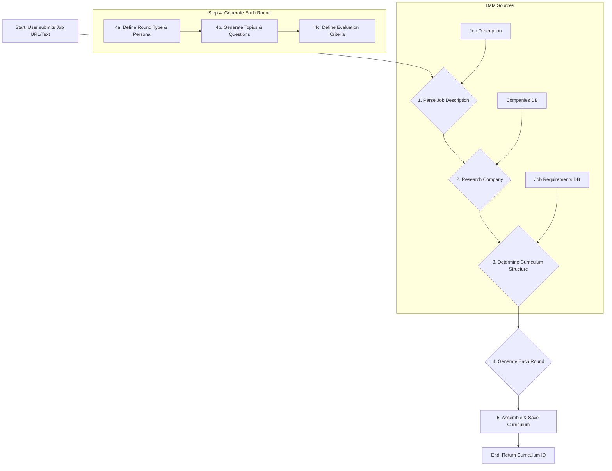

# PrepTalk - Curriculum Maker Agent PRD

**Version:** 1.0  
**Date:** September 2025  
**Status:** `Ready for Development`

---

## 1. Overview

### 1.1 Problem Statement
Job seekers struggle to prepare for interviews because they don't know what to expect. Generic advice is insufficient. They need a personalized, structured, and realistic practice plan tailored to a specific job at a specific company. This plan must go beyond a list of topics and create an interactive, guided experience.

### 1.2 Proposed Solution
The **Curriculum Maker Agent** is an AI-powered system that generates a comprehensive, multi-round interview curriculum based on a user-provided job description. It acts as an expert "interview coach," designing a full practice plan that includes different interview types (behavioral, technical, system design), topics, and evaluation criteria.

### 1.3 Key Features
- **Job Description Ingestion**: Accepts a URL or text of a job description.
- **Company Research Integration**: Pulls data from our `companies` database to tailor the curriculum.
- **Multi-Round Structure**: Generates a logical sequence of interview rounds (e.g., Phone Screen, Technical, Final).
- **Persona-Driven Rounds**: Defines an AI interviewer persona for each round (e.g., "Friendly Recruiter," "Busy Hiring Manager").
- **Topic & Question Generation**: Creates relevant topics and example questions for each round.
- **Evaluation Criteria Definition**: Produces a rubric for assessing candidate performance.
- **Versioning**: Allows curricula to be updated and improved over time.

### 1.4 Success Metrics
- **Primary**:
    - **Curriculum Generation Success Rate**: >98% of requests result in a valid curriculum.
    - **User Adoption**: 75% of users who start a job prep journey generate a curriculum.
    - **User Rating**: Average curriculum rating of 4.5/5.0 stars.
- **Secondary**:
    - **Generation Time**: p95 generation time < 30 seconds.
    - **Coverage Score**: Average curriculum covers >90% of key job requirements.
    - **Completion Rate**: 50% of users complete at least one full interview session from a generated curriculum.

---

## 2. Agent Architecture & Logic

### 2.1 High-Level Flow


### 2.2 Detailed Step-by-Step Logic

1.  **Input Validation & Parsing (Step 1)**
    - **Input**: Job URL or raw text.
    - **Action**:
        - If URL, scrape the content.
        - Use a robust parsing model (e.g., GPT-4 with function calling) to extract structured data: `title`, `company_name`, `responsibilities`, `required_skills`, `preferred_skills`, `experience_level`.
        - Store the parsed job details in the `jobs` table.
    - **Output**: A structured `job` object.

2.  **Company & Role Research (Step 2)**
    - **Input**: `company_name` from the job object.
    - **Action**:
        - Query the `companies` table for pre-existing research data (mission, values, recent news, interview process notes).
        - Query the `interview_patterns` table for known question types or focus areas for this company.
    - **Output**: A "Company Context" document.

3.  **Determine Curriculum Structure (Step 3)**
    - **Input**: Structured `job` object, "Company Context".
    - **Action**: This is the core "planning" step for the agent.
        - **LLM Prompt**: "You are an expert interview coach. Given the following job role and company information, design a realistic, multi-round interview plan. Specify the type and goal of each round. For a *[Job Title]* role at *[Company Name]*, a typical process is..."
        - **Logic**:
            - Based on `experience_level` and `job_type`, determine the number and type of rounds.
                - *Entry-level*: Phone Screen, Technical Screen, Final (Behavioral + Coding).
                - *Senior/Staff*: Recruiter Screen, Technical Deep Dive, System Design, Leadership/Behavioral.
            - Incorporate company-specific patterns (e.g., if `Amazon`, add a "Bar Raiser" behavioral round).
    - **Output**: A list of round definitions, e.g., `[{round: 1, type: 'phone_screen'}, {round: 2, type: 'system_design'}]`.

4.  **Generate Each Round (Step 4 - Loop)**
    - For each round definition from the previous step:
        - **4a. Define Round Persona & Focus**:
            - **LLM Prompt**: "For a *[Round Type]* interview for a *[Job Title]*, create an interviewer persona. Define their role, personality, and what they are trying to assess."
            - **Example Output**: `persona: {name: 'David', role: 'Senior Engineer', personality: 'Pragmatic and direct', goal: 'Assess raw coding ability and problem-solving skills.'}`.
        - **4b. Generate Topics & Questions**:
            - **LLM Prompt**: "Based on the job's required skills *[skills list]* and the focus of this *[Round Type]* round, generate 5-7 key topics to cover and 2-3 sample questions for each."
            - **Example Output**: `topics: [{topic: 'Data Structures', questions: ['...']}, {topic: 'Concurrency', questions: ['...']}]`.
        - **4c. Define Evaluation Criteria**:
            - **LLM Prompt**: "Create a scoring rubric for this *[Round Type]* round. Define 3-5 key criteria and describe what 'Excellent', 'Good', and 'Needs Improvement' looks like for each."
            - **Example Output**: `criteria: [{criterion: 'Problem Solving', rubric: {...}}, {criterion: 'Communication', rubric: {...}}]`.
    - **Output**: A fully detailed `curriculum_rounds` object for each round.

5.  **Assemble & Save Curriculum (Step 5)**
    - **Action**:
        - Combine the overall curriculum plan with the detailed rounds.
        - Create a new record in the `curricula` table.
        - Create associated records in the `curriculum_rounds` table.
        - Link back to the original `job_id`.
    - **Output**: The `curriculum_id` of the newly created record.

---

## 3. Data Models & Storage

*The agent's output maps directly to the `curricula` and `curriculum_rounds` tables.*

- **`curricula` Table**: Stores the high-level plan.
    - `job_id`: Foreign key to the `jobs` table.
    - `version`: For curriculum updates.
    - `title`: e.g., "Senior Software Engineer at Google".
    - `overview`: AI-generated summary.
    - `total_rounds`: Number of rounds determined in Step 3.
    - `generation_model`: The model used (e.g., 'gpt-4-turbo').

- **`curriculum_rounds` Table**: Stores the details for each round.
    - `curriculum_id`: Foreign key to the `curricula` table.
    - `round_number`: The sequence of the round.
    - `round_type`: 'technical', 'behavioral', etc.
    - `title`: e.g., "Technical Screen with Engineer".
    - `interviewer_persona`: JSONB containing the persona from Step 4a.
    - `topics_to_cover`: JSONB containing topics and questions from Step 4b.
    - `evaluation_criteria`: JSONB containing the rubric from Step 4c.

---

## 4. Technical Requirements

### 4.1 Dependencies
- **LLM Provider**: OpenAI (GPT-4-Turbo) or Anthropic (Claude 3 Opus) for high-quality generation.
- **Database**: PostgreSQL with `pgvector` for potential future semantic search on topics.
- **Job Scraper**: A reliable web scraping service (e.g., Browserless, Apify).
- **Internal Data**: Access to the `companies`, `jobs`, and `interview_patterns` tables.

### 4.2 API Endpoints

#### `POST /api/curricula`
- **Description**: The main endpoint to trigger curriculum generation.
- **Request Body**:
    ```json
    {
      "jobUrl": "https://...",
      // OR
      "jobDescription": "...",
      "userId": "..."
    }
    ```
- **Processing**: Asynchronous. The endpoint should immediately return a `taskId` or `jobId` for polling.
    1. Validate input.
    2. Enqueue a background job for the Curriculum Maker Agent.
    3. Return `202 Accepted` with a status polling URL.
- **Response (Accepted)**:
    ```json
    {
      "generationId": "gen_abc123",
      "status": "pending",
      "pollUrl": "/api/curricula/status/gen_abc123"
    }
    ```

#### `GET /api/curricula/status/{generationId}`
- **Description**: Polls for the status of a generation job.
- **Response (Pending)**:
    ```json
    { "status": "processing", "progress": 0.4, "currentStep": "Generating Round 2" }
    ```
- **Response (Success)**:
    ```json
    {
      "status": "completed",
      "curriculumId": "cur_xyz789",
      "viewUrl": "/curriculum/cur_xyz789"
    }
    ```
- **Response (Failed)**:
    ```json
    { "status": "failed", "error": "Could not parse job description." }
    ```

---

## 5. Error Handling & Edge Cases

- **Invalid URL/Unscrapable Page**: The agent should fail gracefully with a clear error message.
- **Unsupported Language**: If the job description is not in English, return an error. (Future: support more languages).
- **Minimalist Job Description**: If the description is too sparse, the agent should rely on the job title and any available company data, but flag the curriculum as "low confidence".
- **Conflicting Information**: If the job description contradicts company data, prioritize the job description as the source of truth.
- **LLM Failure/Timeout**: Implement retry logic with exponential backoff for transient LLM API errors. After 3 failed retries, mark the generation job as failed.
- **Rate Limiting**: Ensure the system handles rate limits from both our internal API and the external LLM provider.

---

## 6. Future Improvements

- **V2: Curriculum from Scratch**: Allow users to generate a curriculum by simply describing a role, without a formal job description.
- **V2: User Feedback Loop**: Allow users to rate the quality of a curriculum. Use these ratings to fine-tune the generation prompts.
- **V3: Dynamic Adjustment**: If a user struggles with a topic, the system could suggest a "remedial" round or add more foundational questions to the existing curriculum.
- **V3: Multi-language Support**: Fine-tune models to handle job descriptions in Spanish, German, etc.