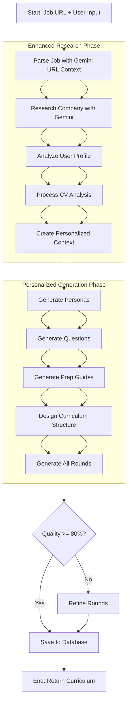

# PrepTalk - Curriculum Maker Agent PRD

**Version:** 2.0
**Date:** September 2025
**Status:** `In Development`

---

## 1. Overview

### 1.1 Problem Statement
Job seekers struggle to prepare for interviews because they don't know what to expect. Generic advice is insufficient. They need a personalized, structured, and realistic practice plan tailored to a specific job at a specific company. This plan must go beyond a list of topics and create an interactive, guided experience.

### 1.2 Proposed Solution
The **Curriculum Maker Agent** is an AI-powered system that generates a comprehensive, **non-technical** interview curriculum based on a user-provided job description. It acts as an expert "interview coach," designing a behavioral and cultural preparation plan that leverages competitive intelligence to help candidates give exceptional answers to standard interview questions.

### 1.2.1 Competitive Differentiation Strategy
**Market Gap Identified**: Technical interview preparation is well-served by platforms like LeetCode, HackerRank, and Pramp. However, behavioral/cultural interview preparation remains generic and company-agnostic.

**Our Solution**: Focus exclusively on **non-technical interview preparation** enhanced by competitive intelligence:
- **Standard Questions**: Interviewers ask universal questions like "Why this company?" and "Tell me about a challenging project"
- **Exceptional Answers**: Our competitive intelligence helps candidates craft responses that demonstrate deep company understanding
- **Realistic Personas**: Interviewer personas ask normal questions but are trained to recognize when candidates understand the company's competitive context

**Example Transformation**:
- **Generic Answer**: "I want to work at Netflix because I love the shows and culture"
- **CI-Enhanced Answer**: "Netflix's $15B content investment vs Disney's $8B creates unique international localization challenges. Having managed multi-region projects, I'm excited about the operational complexity that comes with Netflix's global-first strategy that competitors haven't matched"

### 1.3 Key Features
- **Job Description Ingestion**: Accepts a URL or text of a job description.
- **Competitive Intelligence Research**: Gathers comprehensive competitive positioning, strategic advantages, and recent developments to create company-specific interview preparation.
- **User Personalization Layer**: Collects user focus areas, insecurities, and CV analysis to create truly personalized interview preparation.
- **CV Analysis Integration**: Analyzes user background to identify experience gaps, strength patterns, and career narrative for targeted coaching.
- **Non-Technical Focus**: Generates 5 behavioral/cultural interview rounds (30 minutes each) since technical interview prep is well-covered by competitors.
- **Natural Personalized System**: Creates adaptive personas, questions, and CI integration tailored to individual user needs and company context.
- **Industry-Aware Generation**: Adapts questioning style, follow-up trees, and conversation flow based on industry patterns (entertainment vs finance vs tech).
- **Coordinated Round Progression**: Generates 5 rounds that build user confidence progressively while maintaining narrative consistency.
- **Standard Questions + Insider Answers**: Prepares candidates for universal interview questions while providing competitive intelligence insights to craft standout responses.
- **Recognition Pattern Training**: Teaches candidates what exceptional answers sound like to each type of interviewer persona.
- **Versioning**: Allows curricula to be updated and improved over time.

### 1.4 Success Metrics
- **Primary**:
    - **Curriculum Generation Success Rate**: >98% of requests result in a valid curriculum.
    - **User Adoption**: 75% of users who start a job prep journey generate a curriculum.
    - **User Rating**: Average curriculum rating of 4.5/5.0 stars.
- **Secondary**:
    - **Generation Time**: p95 generation time < 30 seconds.
    - **Coverage Score**: Average curriculum covers >90% of key job requirements.
    - **Completion Rate**: 50% of users complete at least one full interview session from a generated curriculum.

---

## 2. Agent Architecture & Logic

### 2.1 Enhanced Personalized Flow (v2.0)

#### **COMPLETE VISUAL SYSTEM ARCHITECTURE**

```
┌─────────────────────────────────────────────────────────────────────────────┐
│                           INPUT COLLECTION LAYER                             │
├─────────────────┬─────────────────────┬─────────────────────────────────────┤
│   JOB URL       │    USER INPUT       │         CV UPLOAD               │
│ ┌─────────────┐ │ ┌─────────────────┐ │ ┌─────────────────────────────┐   │
│ │• Company CI │ │ │• Focus Areas    │ │ │• Experience Gaps            │   │
│ │• Role Data  │ │ │• Insecurities   │ │ │• Strength Patterns          │   │
│ │• Industry   │ │ │• Career Goals   │ │ │• Career Narrative           │   │
│ │• Recent Dev │ │ │• Interview Prefs│ │ │• Skill Transitions          │   │
│ └─────────────┘ │ └─────────────────┘ │ └─────────────────────────────┘   │
└─────────────────┴─────────────────────┴─────────────────────────────────────┘
                                  │
                                  ▼
┌─────────────────────────────────────────────────────────────────────────────┐
│                         UNIFIED CONTEXT ENGINE                               │
│                                                                             │
│  ┌─────────────────────────────────────────────────────────────────────┐   │
│  │                    ENHANCED STATE                                   │   │
│  │  • Company Intel + User Profile + CV Analysis                      │   │
│  │  • Industry Patterns + Personal Context                            │   │
│  │  • Strength Amplifiers + Gap Bridges + Confidence Builders         │   │
│  └─────────────────────────────────────────────────────────────────────┘   │
└─────────────────────────────────────────────────────────────────────────────┘
                                  │
                                  ▼
┌─────────────────────────────────────────────────────────────────────────────┐
│                    COORDINATED ROUND GENERATION                             │
└─────────────────────────────────────────────────────────────────────────────┘

    ROUND 1              ROUND 2              ROUND 3              ROUND 4              ROUND 5
┌─────────────┐      ┌─────────────┐      ┌─────────────┐      ┌─────────────┐      ┌─────────────┐
│ RECRUITER   │      │ BEHAVIORAL  │      │ CULTURE     │      │ STRATEGIC   │      │ EXECUTIVE   │
│ SCREEN      │───▶  │ DEEP DIVE   │───▶  │ VALUES      │───▶  │ DISCUSSION  │───▶  │ FINAL       │
│             │      │             │      │ ALIGNMENT   │      │             │      │             │
├─────────────┤      ├─────────────┤      ├─────────────┤      ├─────────────┤      ├─────────────┤
│📋 PERSONA:  │      │📋 PERSONA:  │      │📋 PERSONA:  │      │📋 PERSONA:  │      │📋 PERSONA:  │
│ Sarah Chen  │      │ Mike Rodriguez│     │ Emma Thompson│     │ David Kim   │      │ Lisa Johnson│
│ Recruiter   │      │ Sr Manager  │      │ Team Lead   │      │ VP Finance  │      │ C-Level     │
│             │      │             │      │             │      │             │      │             │
│🎯 STYLE:    │      │🎯 STYLE:    │      │🎯 STYLE:    │      │🎯 STYLE:    │      │🎯 STYLE:    │
│ Encouraging │      │ Competency- │      │ Values-     │      │ Strategic   │      │ Vision-     │
│ Career      │      │ focused     │      │ driven      │      │ Business    │      │ focused     │
│ Changer     │      │ Supportive  │      │ Collaborative│     │ Accessible  │      │ Leadership  │
│             │      │             │      │             │      │             │      │             │
│❓QUESTIONS: │      │❓QUESTIONS: │      │❓QUESTIONS: │      │❓QUESTIONS: │      │❓QUESTIONS: │
│ 10 adaptive │      │ 10 adaptive │      │ 10 adaptive │      │ 10 adaptive │      │ 10 adaptive │
│             │      │             │      │             │      │             │      │             │
│💡 CI FOCUS: │      │💡 CI FOCUS: │      │💡 CI FOCUS: │      │💡 CI FOCUS: │      │💡 CI FOCUS: │
│ Research &  │      │ Experience  │      │ Values      │      │ Strategic   │      │ Vision      │
│ Curiosity   │      │ Connection  │      │ Alignment   │      │ Understanding│     │ Contribution│
└─────────────┘      └─────────────┘      └─────────────┘      └─────────────┘      └─────────────┘
```

#### **USER JOURNEY EXAMPLE**: Career Changer (Finance → Entertainment)

```
USER CONTEXT: Career transition, insecure about industry knowledge, strong analytical background

INPUT LAYER:
┌─ JOB: Netflix Tax Analyst ────┬─ USER: Career transition ────┬─ CV: Finance background ─┐
│ • $15B content investment     │ • Focus: Practice transition │ • Gap: No streaming exp  │
│ • 190+ countries operation    │ • Insecure: Industry knowledge│ • Strength: Analytical   │
│ • Global tax complexity       │ • Goal: Entertainment career │ • Narrative: Finance→Ent │
└───────────────────────────────┴───────────────────────────────┴──────────────────────────┘
                                            │
                                            ▼
                            ┌─ PERSONALIZED CONTEXT ─┐
                            │ • Amplify: Analytical   │
                            │ • Bridge: Domain→Netflix │
                            │ • Build: Industry confidence│
                            └─────────────────────────┘

ROUND PROGRESSION:

┌─ ROUND 1: Build Confidence ─────────────────────────────────────────────────┐
│ 👤 Sarah (Encouraging Recruiter)                                            │
│ ❓ "What's drawing you toward entertainment companies?"                      │
│    └─ Lets user practice transition story naturally                         │
│ 💡 CI Opportunity: "What surprised you most in your Netflix research?"      │
│    └─ Creates space for competitive intelligence without testing            │
└──────────────────────────────────────────────────────────────────────────────┘
                                    │ ⬇ Build on success
┌─ ROUND 2: Demonstrate Competence ───────────────────────────────────────────┐
│ 👤 Mike (Competency-focused but Supportive)                                │
│ ❓ "Tell me about your most complex analytical project"                     │
│    └─ Amplifies CV strength (analytical skills)                            │
│ 💡 CI Connection: "How would you apply that to content performance data?"   │
│    └─ Natural bridge from user's domain to Netflix challenges              │
└──────────────────────────────────────────────────────────────────────────────┘
                                    │ ⬇ Layer in values
┌─ ROUND 3: Values Alignment ─────────────────────────────────────────────────┐
│ 👤 Emma (Values-driven, Collaborative)                                     │
│ ❓ "How do you approach learning in new environments?"                      │
│    └─ Addresses industry knowledge gap positively                          │
│ 💡 CI Integration: "That growth mindset aligns with Netflix's innovation"  │
│    └─ Connects user's learning approach to company culture                 │
└──────────────────────────────────────────────────────────────────────────────┘
                                    │ ⬇ Strategic thinking
┌─ ROUND 4: Strategic Discussion ─────────────────────────────────────────────┐
│ 👤 David (Strategic, Business-focused)                                     │
│ ❓ "What trends in finance do you see impacting entertainment?"             │
│    └─ Leverages user's domain expertise for strategic insight              │
│ 💡 CI Opportunity: "How does that relate to Netflix's global approach?"    │
│    └─ Natural bridge to competitive positioning                            │
└──────────────────────────────────────────────────────────────────────────────┘
                                    │ ⬇ Confirm fit
┌─ ROUND 5: Executive Vision ─────────────────────────────────────────────────┐
│ 👤 Lisa (Visionary, Leadership-focused)                                    │
│ ❓ "How do you see your analytical background contributing to our goals?"   │
│    └─ Synthesizes user's value proposition                                 │
│ 💡 CI Culmination: "What unique perspective would you bring to our team?"  │
│    └─ User demonstrates competitive understanding + personal value         │
└──────────────────────────────────────────────────────────────────────────────┘
```

#### **GENERATION ENGINE DETAIL**

```
                    PERSONALIZED ROUND GENERATOR
┌─────────────────────────────────────────────────────────────────────────────────────┐
│                                                                                     │
│  INPUT: Enhanced State + Round Type                                                │
│  ┌─────────────────────────────────────────────────────────────────────────────┐  │
│  │ USER CONTEXT              COMPANY INTEL           ROUND OBJECTIVES          │  │
│  │ • Focus: Career story     • CI: Global scale      • Round 1: Assess fit   │  │
│  │ • Gap: Industry knowledge • Advantage: $15B       • Round 2: Competencies │  │
│  │ • Strength: Analytical    • Recent: Gaming        • Round 3: Culture fit  │  │
│  └─────────────────────────────────────────────────────────────────────────────┘  │
│                                           │                                        │
│                                           ▼                                        │
│  ┌───────────────────┐  ┌─────────────────────────────┐  ┌────────────────────┐  │
│  │   PERSONALIZED    │  │      ADAPTIVE QUESTIONS     │  │   NATURAL CI       │  │
│  │     PERSONA       │  │                             │  │   INTEGRATION      │  │
│  │                   │  │ • Industry-tuned style     │  │                    │  │
│  │ • User-aware      │  │ • Context-smart content    │  │ • Conversational   │  │
│  │ • Style-fit       │  │ • Personal strength focus  │  │ • Research-based   │  │
│  │ • Round-appropriate│  │ • Gap-bridging approach   │  │ • Natural bridges  │  │
│  └───────────────────┘  └─────────────────────────────┘  └────────────────────┘  │
│                                           │                                        │
│                                           ▼                                        │
│  ┌─────────────────────────────────────────────────────────────────────────────┐  │
│  │                    COORDINATED ROUND OUTPUT                                 │  │
│  │ • 10 Questions (adapted to user + round)                                   │  │
│  │ • Persona (styled for user's needs)                                        │  │
│  │ • CI Integration (natural conversation opportunities)                      │  │
│  │ • Prep Guide (user-specific coaching)                                      │  │
│  └─────────────────────────────────────────────────────────────────────────────┘  │
└─────────────────────────────────────────────────────────────────────────────────────┘
```

#### **INPUT → 5 COORDINATED PERSONALIZED ROUNDS**
```
┌─────────────────────────────────────────────────────────────────────────────┐
│                           INPUT COLLECTION LAYER                             │
├─────────────────┬─────────────────────┬─────────────────────────────────────┤
│   JOB URL       │    USER INPUT       │         CV UPLOAD                   │
│ ┌─────────────┐ │ ┌─────────────────┐ │ ┌─────────────────────────────────┐   │
│ │• Company CI │ │ │• Focus Areas    │ │ │• Experience Gaps                │   │
│ │• Role Data  │ │ │• Insecurities   │ │ │• Strength Patterns              │   │
│ │• Industry   │ │ │• Career Goals   │ │ │• Career Narrative               │   │
│ │• Recent Dev │ │ │• Interview Prefs│ │ │• Skill Transitions              │   │
│ └─────────────┘ │ └─────────────────┘ │ └─────────────────────────────────┘   │
└─────────────────┴─────────────────────┴─────────────────────────────────────┘
                                  │
                                  ▼
┌─────────────────────────────────────────────────────────────────────────────┐
│                         UNIFIED CONTEXT ENGINE                               │
│  ┌─────────────────────────────────────────────────────────────────────┐   │
│  │                    ENHANCED STATE                                   │   │
│  │  • Company Intel + User Profile + CV Analysis                      │   │
│  │  • Industry Patterns + Personal Context                            │   │
│  │  • Strength Amplifiers + Gap Bridges + Confidence Builders         │   │
│  └─────────────────────────────────────────────────────────────────────┘   │
└─────────────────────────────────────────────────────────────────────────────┘
                                  │
                                  ▼
┌─────────────────────────────────────────────────────────────────────────────┐
│                    COORDINATED ROUND GENERATION                             │
│                                                                             │
│    ROUND 1          ROUND 2          ROUND 3          ROUND 4          ROUND 5    │
│ ┌───────────┐   ┌───────────┐   ┌───────────┐   ┌───────────┐   ┌───────────┐ │
│ │RECRUITER  │──▶│BEHAVIORAL │──▶│CULTURE    │──▶│STRATEGIC  │──▶│EXECUTIVE  │ │
│ │SCREEN     │   │DEEP DIVE  │   │VALUES     │   │DISCUSSION │   │FINAL      │ │
│ │           │   │           │   │ALIGNMENT  │   │           │   │           │ │
│ │📋PERSONA: │   │📋PERSONA: │   │📋PERSONA: │   │📋PERSONA: │   │📋PERSONA: │ │
│ │User-aware │   │Competency │   │Values-    │   │Strategic  │   │Vision-    │ │
│ │Encouraging│   │Supportive │   │Collab.    │   │Business   │   │Leadership │ │
│ │           │   │           │   │           │   │           │   │           │ │
│ │❓10 ADAPT │   │❓10 ADAPT │   │❓10 ADAPT │   │❓10 ADAPT │   │❓10 ADAPT │ │
│ │QUESTIONS  │   │QUESTIONS  │   │QUESTIONS  │   │QUESTIONS  │   │QUESTIONS  │ │
│ │           │   │           │   │           │   │           │   │           │ │
│ │💡NATURAL  │   │💡NATURAL  │   │💡NATURAL  │   │💡NATURAL  │   │💡NATURAL  │ │
│ │CI BUILD   │   │CI CONNECT │   │CI ALIGN   │   │CI STRATEGIC│  │CI VISION  │ │
│ └───────────┘   └───────────┘   └───────────┘   └───────────┘   └───────────┘ │
└─────────────────────────────────────────────────────────────────────────────┘
```

### 2.2 High-Level Flow (LangGraph Architecture)


### 2.2 Implementation Architecture

**Technology Stack:**
- **LangGraph**: State-based graph orchestration
- **Gemini 2.5 Flash**: Primary LLM with URL context capabilities
- **No external scraping**: Gemini handles all web content fetching
- **Single graph**: No subgraphs needed for simpler state management

### 2.3 Enhanced Node Implementation

#### **NEW: User Personalization Nodes**

1. **Analyze User Profile Node**
   - **Input**: User form data (focus areas, insecurities, career goals, preferences)
   - **Method**: Structure and validate user personalization data
   - **Action**:
     - Parse focus areas ("practice leadership stories", "career transition")
     - Identify insecurities ("limited industry knowledge", "no international experience")
     - Extract career goals and interview preferences
   - **Output**: UserPersonalization object

2. **Process CV Analysis Node**
   - **Input**: CV file upload + UserPersonalization
   - **Method**: LLM-powered CV analysis with competitive intelligence context
   - **Action**:
     - Extract text from PDF/document
     - Analyze experience gaps vs job requirements
     - Identify strength patterns and transferable skills
     - Generate career narrative and transition story
     - Map skills to industry requirements
   - **Output**: CVAnalysis object with gaps, strengths, and narrative

3. **Create Personalized Context Node**
   - **Input**: UserPersonalization + CVAnalysis + CompetitiveIntelligence
   - **Method**: Synthesize all inputs into unified coaching context
   - **Action**:
     - Create strength amplifiers (how to leverage user's background)
     - Design gap bridges (how to address weaknesses positively)
     - Build confidence builders (reframe insecurities as growth areas)
     - Map competitive advantages to user's unique value proposition
   - **Output**: PersonalizedContext for round generation

#### **Enhanced Generation Nodes**

4. **Generate Personalized Personas Node**
   - **Input**: PersonalizedContext + CompetitiveIntelligence + RolePatterns
   - **Method**: AI-powered persona creation with user-awareness
   - **Core Innovation**: Personas adapt style and approach to user's specific needs
   - **Persona Adaptation Process**:
     - **User-Aware Styling**: Adjust questioning approach based on insecurities
     - **Industry Patterns**: Apply entertainment vs finance vs tech interviewing styles
     - **Strength Focus**: Design personas to draw out user's key advantages
     - **Gap-Sensitive**: Avoid triggering user's insecurities unnecessarily
   - **For each round persona**:
     - **Identity**: Name, role, tenure (standard)
     - **User-Adapted Style**: Encouraging vs challenging based on user profile
     - **Personal Context Awareness**: Knowledge of user's background and goals
     - **CI Integration**: Company knowledge that complements user's research
   - **Output**: Array of 5 user-aware personas

5. **Generate Adaptive Questions Node**
   - **Input**: PersonalizedPersonas + UserProfile + IndustryPatterns
   - **Method**: Dynamic question generation with multi-dimensional context
   - **Question Generation Strategy**:
     - **Industry-Tuned Style**: Entertainment = creative+analytical, Finance = precision+judgment
     - **User Context Integration**: Questions that let user practice focus areas
     - **Strength Amplification**: Questions designed to highlight user's advantages
     - **Gap Bridging**: Questions that address weaknesses constructively
     - **Natural CI Opportunities**: Questions that create space for competitive intelligence
   - **For each round (10 questions each)**:
     - **Adaptive Categories**: Motivation, behavioral, role_scenarios, company_knowledge, culture_fit, forward_vision
     - **Dynamic Follow-up Trees**: 4 contextual follow-ups per question
     - **Difficulty Progression**: Warm-up → Standard → Challenging based on user comfort
     - **Personal Relevance**: Questions connect to user's background and goals
   - **Output**: QuestionSets tailored to user + company + round objectives

6. **Generate Natural CI Integration Node**
   - **Input**: AdaptiveQuestions + CompetitiveIntelligence + UserProfile
   - **Method**: Create conversational opportunities for competitive intelligence
   - **Natural Integration Strategy**:
     - **Research-Based Curiosity**: "I noticed Netflix's expansion into..."
     - **Experience Bridges**: Connect user's background to company challenges
     - **Conversational Opportunities**: Natural moments to weave in CI insights
     - **Avoid Statistics Dumping**: No forced "$15B vs $8B" recitations
   - **For each question**:
     - **CI Touch Points**: 2-3 natural ways to integrate competitive intelligence
     - **Conversation Starters**: User-friendly ways to bring up research
     - **Bridge Phrases**: "That reminds me of...", "I was reading about..."
     - **Recognition Cues**: What interviewers listen for in exceptional answers
   - **Output**: NaturalCIGuide for each round

#### **Existing Nodes (Enhanced)**

7. **Parse Job Node**
   - **Input**: Job URL from state
   - **Method**: Gemini URL context API
   - **Action**:
     - Pass job URL directly to Gemini with extraction prompt
     - Extract: title, company, level, requirements, responsibilities
   - **Output**: Structured JobData object

2. **Enhanced Role Analysis Node** (Replaces Company Research + Role Patterns)
   - **Input**: JobData from parsing
   - **Method**: Gemini with Google Search + URL Context grounding
   - **Enhanced Research Process**:
     - **Dynamic Date Context**: Uses current year/recent period, never hardcoded dates
     - **12 Research Queries**: 6 basic + 6 competitive intelligence queries
       - Basic: Company culture, interview process, salary ranges, preparation tips
       - Competitive: Role comparison vs competitors, strategic advantages, recent developments
     - **Multi-tool API Call**: Uses both Google Search and URL Context simultaneously
   - **Competitive Intelligence Output**:
     - Primary competitors with context
     - Detailed role comparison vs competitors (2-3 sentences with examples)
     - Strategic advantages with specific metrics/examples
     - Recent developments with dates and context
     - Market positioning analysis for this specific role
   - **Fallback Handling**: If enhanced research fails, gracefully falls back to basic analysis
   - **Output**:
     - RolePatterns (typical rounds, focus areas, formats)
     - Enhanced MarketIntelligence (salary context, difficulty, trends)
     - CompetitiveIntelligence (competitors, positioning, advantages)
     - CompanyContext (updated with research findings)

3. **Design Non-Technical Structure Node**
   - **Input**: All research data (JobData, CompanyContext, RolePatterns, CompetitiveIntelligence)
   - **Method**: Gemini structured generation focusing on behavioral/cultural assessment
   - **Logic**: **5 Standard Non-Technical Rounds (All 30 minutes)**:
     1. **Phone Screen** - Basic motivation and company interest
     2. **Behavioral Deep Dive** - STAR methodology and past experiences
     3. **Culture & Values Alignment** - Company culture fit assessment
     4. **Strategic Role Discussion** - Role understanding and strategic thinking
     5. **Executive Final** - Leadership alignment and long-term vision
   - **Differentiation Strategy**: Focus on behavioral/cultural prep since technical interview prep is well-covered by competitors
   - **Output**: Fixed 5-round non-technical curriculum structure

   *[Replaced by Enhanced Generation Nodes above]*

5. **Evaluate Quality Node**
   - **Input**: Generated rounds
   - **Criteria**:
     - Coverage of job requirements (>90%)
     - Appropriate difficulty for level
     - Clear evaluation criteria
     - Realistic progression
   - **Output**: Quality score (0-100)

6. **Refine Rounds Node** (Conditional)
   - **Triggers**: If quality < 80%
   - **Action**: Re-generate weak areas identified
   - **Limit**: Max 1 refinement attempt
   - **Output**: Updated rounds

8. **Save Curriculum Node** (Enhanced)
   - **Input**: Final curriculum with rounds + competitive intelligence
   - **Action**:
     - Save to `curricula` table
     - Save rounds to `curriculum_rounds` table
     - **ENHANCED**: Save competitive intelligence to `role_intelligence` JSONB column
     - **NEW**: Save user personalization to `user_profiles` table
     - **NEW**: Save personalized prep guides to `candidate_prep_guide` JSONB column in rounds
     - Update job record with curriculum ID
   - **Enhanced Storage Structure**:
     - **Competitive Intelligence**: Role comparison, strategic advantages, recent developments
     - **User Personalization**: Focus areas, insecurities, CV analysis, personalized context
     - **Adaptive Content**: User-aware personas, personalized questions, natural CI integration
     - **Coordinated Rounds**: 5 rounds that progress user's story while building confidence
   - **Output**: Curriculum ID with full personalization context

---

## 3. Enhanced Data Models & Storage

*The enhanced agent output maps to extended database schema supporting full personalization.*

### 3.1 New Tables

- **`user_profiles` Table**: **NEW** - Stores user personalization data
    - `id`: Primary key UUID
    - `user_id`: Foreign key to user (when authentication implemented)
    - `focus_areas`: JSONB array - ["practice leadership stories", "career transition"]
    - `insecurities`: JSONB array - ["limited industry knowledge", "no international experience"]
    - `career_goals`: JSONB array - ["VP track", "international experience"]
    - `interview_preferences`: JSONB object - style preferences
    - `cv_analysis`: JSONB object - gaps, strengths, narrative, skill transitions
    - `created_at`: Timestamp
    - `updated_at`: Timestamp

### 3.2 Enhanced Existing Tables

- **`curricula` Table**: Enhanced with personalization
    - `job_id`: Foreign key to the `jobs` table
    - `user_profile_id`: **NEW** - Foreign key to `user_profiles` table
    - `version`: For curriculum updates
    - `title`: e.g., "Senior Software Engineer at Google"
    - `overview`: AI-generated summary
    - `total_rounds`: Number of rounds (always 5 for non-technical)
    - `generation_model`: The model used (e.g., 'gemini-2.5-flash')
    - `personalization_context`: **NEW** (JSONB) - User-specific coaching context:
      - `strength_amplifiers`: How to leverage user's background
      - `gap_bridges`: How to address weaknesses positively
      - `confidence_builders`: Reframe insecurities as growth areas
      - `ci_integration_strategy`: User-specific approach to weaving in competitive intelligence
    - `role_intelligence` (JSONB): **ENHANCED** - Competitive intelligence storage:
      - `role_vs_competitors`: How this role differs from competitors
      - `strategic_advantages`: Company-specific advantages for this role
      - `recent_role_developments`: Recent changes affecting the role
      - `market_context`: Salary, difficulty, and preparation insights
      - `competitive_positioning`: Market position analysis
      - `industry_patterns`: Questioning style, common challenges, interview focus

- **`curriculum_rounds` Table**: Enhanced with personalized content
    - `curriculum_id`: Foreign key to the `curricula` table
    - `round_number`: The sequence of the round (1-5)
    - `round_type`: 'recruiter_screen', 'behavioral_deep_dive', 'culture_values_alignment', 'strategic_role_discussion', 'executive_final'
    - `title`: e.g., "Recruiter Screen with Global Talent Recruiter"
    - `interviewer_persona`: **ENHANCED** JSONB - User-aware personas:
      - `identity`: Name, role, tenure, personality
      - `user_adapted_style`: Questioning approach based on user profile
      - `personal_context_awareness`: Knowledge of user's background
      - `ci_knowledge_base`: Strategic advantages and recent developments
    - `topics_to_cover`: **ENHANCED** JSONB - Adaptive questions (10 per round):
      - `questions`: Array of 10 questions with categories, difficulty, time allocation
      - `follow_up_trees`: 4 contextual follow-ups per question
      - `user_focus_integration`: How questions address user's practice areas
    - `candidate_prep_guide`: **NEW** JSONB - Personalized preparation:
      - `ci_talking_points`: Natural ways to weave competitive intelligence
      - `strength_showcasing`: How to highlight user's advantages
      - `gap_addressing`: Positive approaches to handle weaknesses
      - `conversation_strategies`: Natural bridges and research integration
    - `evaluation_criteria`: JSONB containing the rubric

---

## 4. Technical Requirements

### 4.1 Dependencies
- **LLM Provider**: Google Gemini 2.0 Flash (primary) with URL context capability
- **Orchestration**: LangGraph for state management and flow control
- **Database**: PostgreSQL (existing Supabase instance)
- **No External Scrapers**: Gemini's URL context replaces traditional scraping
- **Internal Data**: Access to `companies`, `jobs`, and `interview_patterns` tables

### 4.2 Enhanced API Endpoints

#### `POST /api/curricula` (Enhanced)
- **Description**: The main endpoint to trigger personalized curriculum generation.
- **Request Body**:
    ```json
    {
      "jobUrl": "https://...",
      // OR
      "jobDescription": "...",
      "userId": "...",
      // NEW: User personalization
      "userProfile": {
        "focusAreas": ["practice leadership stories", "career transition"],
        "insecurities": ["limited industry knowledge"],
        "careerGoals": ["VP track", "international experience"],
        "interviewPreferences": {
          "style": "collaborative",
          "pace": "standard"
        }
      },
      // NEW: CV upload (multipart form data)
      "cvFile": "<file>"
    }
    ```
- **Processing**: Asynchronous. The endpoint should immediately return a `taskId` or `jobId` for polling.
    1. Validate input.
    2. Enqueue a background job for the Curriculum Maker Agent.
    3. Return `202 Accepted` with a status polling URL.
- **Response (Accepted)**:
    ```json
    {
      "generationId": "gen_abc123",
      "status": "pending",
      "pollUrl": "/api/curricula/status/gen_abc123"
    }
    ```

#### `GET /api/curricula/status/{generationId}`
- **Description**: Polls for the status of a generation job.
- **Response (Pending)**:
    ```json
    { "status": "processing", "progress": 0.4, "currentStep": "Generating Round 2" }
    ```
- **Response (Success)**:
    ```json
    {
      "status": "completed",
      "curriculumId": "cur_xyz789",
      "userProfileId": "up_abc123",
      "personalizationSummary": {
        "strengthsIdentified": 3,
        "gapsBridged": 2,
        "confidenceBuildersCreated": 4,
        "ciIntegrationPoints": 15
      },
      "viewUrl": "/curriculum/cur_xyz789"
    }
    ```
- **Response (Failed)**:
    ```json
    { "status": "failed", "error": "Could not parse job description." }
    ```

---

## 5. Error Handling & Edge Cases

### 5.1 Implemented Error Handling
- **Environment Validation**: Clear error messages for missing API keys/database credentials
- **JSON Parsing Failures**: Detects when LLM returns "I apologize..." instead of JSON, uses fallbacks
- **Safe Property Access**: Defensive coding prevents null/undefined crashes (`?.` operators)
- **Enhanced Research Fallback**: If competitive intelligence fails, gracefully falls back to basic analysis
- **Malformed Data Handling**: System continues with warnings rather than crashing

### 5.2 LangGraph Built-in Protections
- **Recursion Limits**: Prevents infinite loops with configurable limits
- **Tool Error Handling**: ToolNode automatically catches and converts errors to messages
- **State Validation**: Ensures nodes return proper state structures
- **Automatic Retries**: Built-in retry mechanisms for transient failures

### 5.3 Edge Cases
- **Invalid URL/Unscrapable Page**: Returns helpful error message, suggests manual job description
- **Unsupported Language**: Returns error with language detection (Future: support more languages)
- **Minimalist Job Description**: Uses fallback data, flags curriculum as "low confidence"
- **Conflicting Information**: Prioritizes job description as source of truth
- **API Rate Limiting**: Handles gracefully with exponential backoff
- **LLM Non-JSON Responses**: Detects apologetic responses, provides structured fallbacks

### 5.4 Observability & Debugging
- **Future**: LangSmith integration for automatic error tracking and debugging
- **Structured Logging**: Comprehensive error context for troubleshooting
- **Quality Metrics**: Tracks parsing confidence and research success rates

---

## 6. Implementation Status & Future Improvements

### 6.1 Current Status (v1.0 - COMPLETED)
- ✅ **LangGraph Architecture**: Complete state-based orchestration
- ✅ **Job URL Parsing**: Gemini URL context for direct job posting analysis
- ✅ **Competitive Intelligence**: Enhanced research with 12 comprehensive queries
- ✅ **Dynamic Date Context**: Future-proof date handling (no hardcoded years)
- ✅ **JSONB Storage**: Flexible competitive intelligence persistence
- ✅ **Error Handling**: Production-ready defensive coding with graceful degradation
- ✅ **End-to-End Testing**: Comprehensive test coverage with Netflix job validation
- ✅ **Enhanced Question Generation**: 10 questions per round with 6 categories and difficulty progression

### 6.2 Current Status (v2.0 - IN PROGRESS)
- 🔄 **Personalized System Design**: Complete architecture and PRD documentation
- 🔄 **Enhanced Question System**: Extended from 3-6 to 10 questions with natural follow-up trees
- ⏳ **User Input Interface**: Frontend components for personalization data collection
- ⏳ **CV Analysis Engine**: LLM-powered resume analysis and gap identification
- ⏳ **Natural CI Integration**: Conversational competitive intelligence weaving patterns

### 6.3 Implementation Priorities (v2.0 Roadmap)

#### **Phase 1: User Input System** (Highest Priority)
- **Frontend Components**: User onboarding form, CV upload interface, focus area selection
- **Backend Integration**: User profile creation, file upload handling, data validation
- **Database Migration**: User profiles table, enhanced curricula schema
- **Estimated Timeline**: 2-3 weeks

#### **Phase 2: CV Analysis Engine** (High Priority)
- **PDF Processing**: Text extraction from resume files
- **LLM Analysis**: Gap identification, strength pattern recognition, career narrative generation
- **Context Integration**: Connect CV insights to competitive intelligence
- **Estimated Timeline**: 2-3 weeks

#### **Phase 3: Natural Personalized Generation** (Medium Priority)
- **Enhanced State Management**: Integrate user profile + CV data into curriculum generation
- **Adaptive Persona Creation**: User-aware interviewer personas with industry patterns
- **Natural CI Integration**: Conversational competitive intelligence weaving
- **Coordinated Round Generation**: 5 rounds building user confidence progressively
- **Estimated Timeline**: 3-4 weeks

#### **Phase 4: Testing & Optimization** (Medium Priority)
- **End-to-End Testing**: Full personalized flow validation
- **Quality Assurance**: Natural conversation flow testing
- **Performance Optimization**: Generation speed improvements
- **User Experience**: Interface polish and feedback integration
- **Estimated Timeline**: 2 weeks

### 6.4 Future Improvements (v3.0+)
- **Advanced Personalization**: Learning from user practice sessions and interview outcomes
- **Dynamic Content Updates**: Real-time competitive intelligence updates
- **Multi-Company Comparisons**: Comparative interview preparation across multiple opportunities
- **Industry-Specific Templates**: Specialized preparation for different sectors (tech, finance, consulting, etc.)
- **Collaborative Features**: Team interview preparation and peer practice matching
- **Mobile Application**: Native mobile app for practice sessions