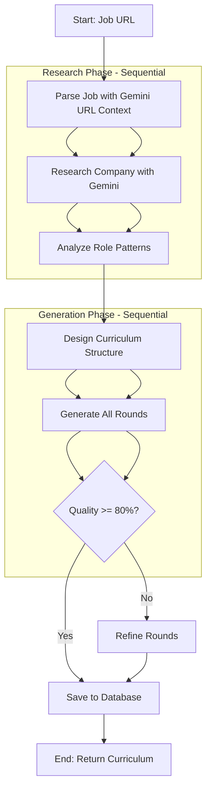

# PrepTalk - Curriculum Maker Agent PRD

**Version:** 2.0
**Date:** September 2025
**Status:** `In Development`

---

## 1. Overview

### 1.1 Problem Statement
Job seekers struggle to prepare for interviews because they don't know what to expect. Generic advice is insufficient. They need a personalized, structured, and realistic practice plan tailored to a specific job at a specific company. This plan must go beyond a list of topics and create an interactive, guided experience.

### 1.2 Proposed Solution
The **Curriculum Maker Agent** is an AI-powered system that generates a comprehensive, multi-round interview curriculum based on a user-provided job description. It acts as an expert "interview coach," designing a full practice plan that includes different interview types (behavioral, technical, system design), topics, and evaluation criteria.

### 1.3 Key Features
- **Job Description Ingestion**: Accepts a URL or text of a job description.
- **Company Research Integration**: Pulls data from our `companies` database to tailor the curriculum.
- **Multi-Round Structure**: Generates a logical sequence of interview rounds (e.g., Phone Screen, Technical, Final).
- **Persona-Driven Rounds**: Defines an AI interviewer persona for each round (e.g., "Friendly Recruiter," "Busy Hiring Manager").
- **Topic & Question Generation**: Creates relevant topics and example questions for each round.
- **Evaluation Criteria Definition**: Produces a rubric for assessing candidate performance.
- **Versioning**: Allows curricula to be updated and improved over time.

### 1.4 Success Metrics
- **Primary**:
    - **Curriculum Generation Success Rate**: >98% of requests result in a valid curriculum.
    - **User Adoption**: 75% of users who start a job prep journey generate a curriculum.
    - **User Rating**: Average curriculum rating of 4.5/5.0 stars.
- **Secondary**:
    - **Generation Time**: p95 generation time < 30 seconds.
    - **Coverage Score**: Average curriculum covers >90% of key job requirements.
    - **Completion Rate**: 50% of users complete at least one full interview session from a generated curriculum.

---

## 2. Agent Architecture & Logic

### 2.1 High-Level Flow (LangGraph Architecture)


### 2.2 Implementation Architecture

**Technology Stack:**
- **LangGraph**: State-based graph orchestration
- **Gemini 2.5 Flash**: Primary LLM with URL context capabilities
- **No external scraping**: Gemini handles all web content fetching
- **Single graph**: No subgraphs needed for simpler state management

### 2.3 Detailed Node Implementation

1. **Parse Job Node**
   - **Input**: Job URL from state
   - **Method**: Gemini URL context API
   - **Action**:
     - Pass job URL directly to Gemini with extraction prompt
     - Extract: title, company, level, requirements, responsibilities
   - **Output**: Structured JobData object

2. **Enhanced Role Analysis Node** (Replaces Company Research + Role Patterns)
   - **Input**: JobData from parsing
   - **Method**: Gemini with Google Search + URL Context grounding
   - **Enhanced Research Process**:
     - **Dynamic Date Context**: Uses current year/recent period, never hardcoded dates
     - **12 Research Queries**: 6 basic + 6 competitive intelligence queries
       - Basic: Company culture, interview process, salary ranges, preparation tips
       - Competitive: Role comparison vs competitors, strategic advantages, recent developments
     - **Multi-tool API Call**: Uses both Google Search and URL Context simultaneously
   - **Competitive Intelligence Output**:
     - Primary competitors with context
     - Detailed role comparison vs competitors (2-3 sentences with examples)
     - Strategic advantages with specific metrics/examples
     - Recent developments with dates and context
     - Market positioning analysis for this specific role
   - **Fallback Handling**: If enhanced research fails, gracefully falls back to basic analysis
   - **Output**:
     - RolePatterns (typical rounds, focus areas, formats)
     - Enhanced MarketIntelligence (salary context, difficulty, trends)
     - CompetitiveIntelligence (competitors, positioning, advantages)
     - CompanyContext (updated with research findings)

3. **Design Structure Node**
   - **Input**: All research data (JobData, CompanyContext, RolePatterns, CompetitiveIntelligence)
   - **Method**: Gemini structured generation
   - **Logic**:
     - Entry-level: 3 rounds (Phone, Technical, Behavioral)
     - Mid/Senior: 4-5 rounds (+ System Design)
     - Staff/Principal: 5-6 rounds (+ Architecture, Leadership)
   - **Enhanced Context**: Uses competitive intelligence for more realistic round design
   - **Output**: CurriculumStructure with round types

4. **Generate Rounds Node**
   - **Input**: CurriculumStructure + all context (including competitive intelligence)
   - **Method**: Sequential generation per round type
   - **For each round**:
     - Generate interviewer persona
     - Create 5-7 topics with 2-3 questions each
     - Define evaluation rubric (3-5 criteria)
     - Incorporate competitive insights for realistic questions
   - **Output**: Array of Round objects

5. **Evaluate Quality Node**
   - **Input**: Generated rounds
   - **Criteria**:
     - Coverage of job requirements (>90%)
     - Appropriate difficulty for level
     - Clear evaluation criteria
     - Realistic progression
   - **Output**: Quality score (0-100)

6. **Refine Rounds Node** (Conditional)
   - **Triggers**: If quality < 80%
   - **Action**: Re-generate weak areas identified
   - **Limit**: Max 1 refinement attempt
   - **Output**: Updated rounds

7. **Save Curriculum Node** (Enhanced)
   - **Input**: Final curriculum with rounds + competitive intelligence
   - **Action**:
     - Save to `curricula` table
     - Save rounds to `curriculum_rounds` table
     - **NEW**: Save competitive intelligence to `role_intelligence` JSONB column
     - Update job record with curriculum ID
   - **Competitive Intelligence Storage**:
     - Role comparison vs competitors
     - Strategic advantages
     - Recent role developments
     - Market context (salary, difficulty, preparation time)
     - Competitive positioning
   - **Output**: Curriculum ID

---

## 3. Data Models & Storage

*The agent's output maps directly to the `curricula` and `curriculum_rounds` tables.*

- **`curricula` Table**: Stores the high-level plan.
    - `job_id`: Foreign key to the `jobs` table.
    - `version`: For curriculum updates.
    - `title`: e.g., "Senior Software Engineer at Google".
    - `overview`: AI-generated summary.
    - `total_rounds`: Number of rounds determined in Step 3.
    - `generation_model`: The model used (e.g., 'gemini-2.5-flash').
    - **`role_intelligence`** (JSONB): **NEW** - Competitive intelligence storage:
      - `role_vs_competitors`: How this role differs from competitors
      - `strategic_advantages`: Company-specific advantages for this role
      - `recent_role_developments`: Recent changes affecting the role
      - `market_context`: Salary, difficulty, and preparation insights
      - `competitive_positioning`: Market position analysis

- **`curriculum_rounds` Table**: Stores the details for each round.
    - `curriculum_id`: Foreign key to the `curricula` table.
    - `round_number`: The sequence of the round.
    - `round_type`: 'technical', 'behavioral', etc.
    - `title`: e.g., "Technical Screen with Engineer".
    - `interviewer_persona`: JSONB containing the persona from Step 4a.
    - `topics_to_cover`: JSONB containing topics and questions from Step 4b.
    - `evaluation_criteria`: JSONB containing the rubric from Step 4c.

---

## 4. Technical Requirements

### 4.1 Dependencies
- **LLM Provider**: Google Gemini 2.0 Flash (primary) with URL context capability
- **Orchestration**: LangGraph for state management and flow control
- **Database**: PostgreSQL (existing Supabase instance)
- **No External Scrapers**: Gemini's URL context replaces traditional scraping
- **Internal Data**: Access to `companies`, `jobs`, and `interview_patterns` tables

### 4.2 API Endpoints

#### `POST /api/curricula`
- **Description**: The main endpoint to trigger curriculum generation.
- **Request Body**:
    ```json
    {
      "jobUrl": "https://...",
      // OR
      "jobDescription": "...",
      "userId": "..."
    }
    ```
- **Processing**: Asynchronous. The endpoint should immediately return a `taskId` or `jobId` for polling.
    1. Validate input.
    2. Enqueue a background job for the Curriculum Maker Agent.
    3. Return `202 Accepted` with a status polling URL.
- **Response (Accepted)**:
    ```json
    {
      "generationId": "gen_abc123",
      "status": "pending",
      "pollUrl": "/api/curricula/status/gen_abc123"
    }
    ```

#### `GET /api/curricula/status/{generationId}`
- **Description**: Polls for the status of a generation job.
- **Response (Pending)**:
    ```json
    { "status": "processing", "progress": 0.4, "currentStep": "Generating Round 2" }
    ```
- **Response (Success)**:
    ```json
    {
      "status": "completed",
      "curriculumId": "cur_xyz789",
      "viewUrl": "/curriculum/cur_xyz789"
    }
    ```
- **Response (Failed)**:
    ```json
    { "status": "failed", "error": "Could not parse job description." }
    ```

---

## 5. Error Handling & Edge Cases

### 5.1 Implemented Error Handling
- **Environment Validation**: Clear error messages for missing API keys/database credentials
- **JSON Parsing Failures**: Detects when LLM returns "I apologize..." instead of JSON, uses fallbacks
- **Safe Property Access**: Defensive coding prevents null/undefined crashes (`?.` operators)
- **Enhanced Research Fallback**: If competitive intelligence fails, gracefully falls back to basic analysis
- **Malformed Data Handling**: System continues with warnings rather than crashing

### 5.2 LangGraph Built-in Protections
- **Recursion Limits**: Prevents infinite loops with configurable limits
- **Tool Error Handling**: ToolNode automatically catches and converts errors to messages
- **State Validation**: Ensures nodes return proper state structures
- **Automatic Retries**: Built-in retry mechanisms for transient failures

### 5.3 Edge Cases
- **Invalid URL/Unscrapable Page**: Returns helpful error message, suggests manual job description
- **Unsupported Language**: Returns error with language detection (Future: support more languages)
- **Minimalist Job Description**: Uses fallback data, flags curriculum as "low confidence"
- **Conflicting Information**: Prioritizes job description as source of truth
- **API Rate Limiting**: Handles gracefully with exponential backoff
- **LLM Non-JSON Responses**: Detects apologetic responses, provides structured fallbacks

### 5.4 Observability & Debugging
- **Future**: LangSmith integration for automatic error tracking and debugging
- **Structured Logging**: Comprehensive error context for troubleshooting
- **Quality Metrics**: Tracks parsing confidence and research success rates

---

## 6. Implementation Status & Future Improvements

### 6.1 Current Status (v1.0 - COMPLETED)
- ✅ **LangGraph Architecture**: Complete state-based orchestration
- ✅ **Job URL Parsing**: Gemini URL context for direct job posting analysis
- ✅ **Competitive Intelligence**: Enhanced research with 12 comprehensive queries
- ✅ **Dynamic Date Context**: Future-proof date handling (no hardcoded years)
- ✅ **JSONB Storage**: Flexible competitive intelligence persistence
- ✅ **Error Handling**: Production-ready defensive coding with graceful degradation
- ✅ **End-to-End Testing**: Comprehensive test coverage with Netflix job validation

### 6.2 Immediate Next Steps
- **LangSmith Integration**: Automatic error tracking and performance monitoring
- **API Integration**: Connect to existing PrepTalk backend and authentication
- **Frontend Integration**: Display competitive intelligence in curriculum UI

### 6.3 Future Improvements
- **V2: Curriculum from Scratch**: Generate curricula from role descriptions without formal job postings
- **V2: User Feedback Loop**: Rating system to fine-tune generation quality
- **V2: Enhanced Competitive Analysis**: Company-level intelligence caching for efficiency
- **V3: Dynamic Adjustment**: Adaptive curricula based on user performance
- **V3: Multi-language Support**: International job posting support
- **V3: Real-time Updates**: Live competitive intelligence updates as market conditions change