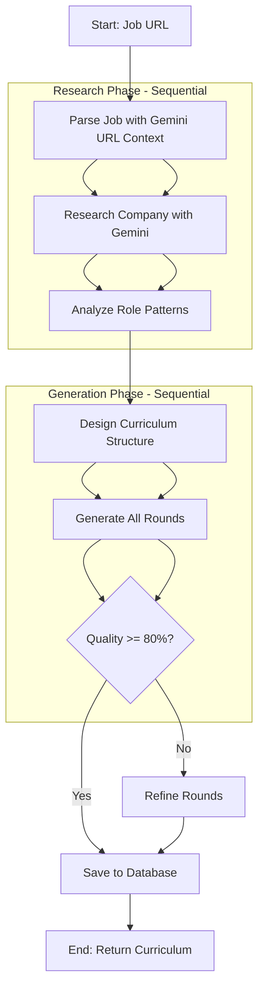

# PrepTalk - Curriculum Maker Agent PRD

**Version:** 2.0
**Date:** September 2025
**Status:** `In Development`

---

## 1. Overview

### 1.1 Problem Statement
Job seekers struggle to prepare for interviews because they don't know what to expect. Generic advice is insufficient. They need a personalized, structured, and realistic practice plan tailored to a specific job at a specific company. This plan must go beyond a list of topics and create an interactive, guided experience.

### 1.2 Proposed Solution
The **Curriculum Maker Agent** is an AI-powered system that generates a comprehensive, multi-round interview curriculum based on a user-provided job description. It acts as an expert "interview coach," designing a full practice plan that includes different interview types (behavioral, technical, system design), topics, and evaluation criteria.

### 1.3 Key Features
- **Job Description Ingestion**: Accepts a URL or text of a job description.
- **Company Research Integration**: Pulls data from our `companies` database to tailor the curriculum.
- **Multi-Round Structure**: Generates a logical sequence of interview rounds (e.g., Phone Screen, Technical, Final).
- **Persona-Driven Rounds**: Defines an AI interviewer persona for each round (e.g., "Friendly Recruiter," "Busy Hiring Manager").
- **Topic & Question Generation**: Creates relevant topics and example questions for each round.
- **Evaluation Criteria Definition**: Produces a rubric for assessing candidate performance.
- **Versioning**: Allows curricula to be updated and improved over time.

### 1.4 Success Metrics
- **Primary**:
    - **Curriculum Generation Success Rate**: >98% of requests result in a valid curriculum.
    - **User Adoption**: 75% of users who start a job prep journey generate a curriculum.
    - **User Rating**: Average curriculum rating of 4.5/5.0 stars.
- **Secondary**:
    - **Generation Time**: p95 generation time < 30 seconds.
    - **Coverage Score**: Average curriculum covers >90% of key job requirements.
    - **Completion Rate**: 50% of users complete at least one full interview session from a generated curriculum.

---

## 2. Agent Architecture & Logic

### 2.1 High-Level Flow (LangGraph Architecture)


### 2.2 Implementation Architecture

**Technology Stack:**
- **LangGraph**: State-based graph orchestration
- **Gemini 2.5 Flash**: Primary LLM with URL context capabilities
- **No external scraping**: Gemini handles all web content fetching
- **Single graph**: No subgraphs needed for simpler state management

### 2.3 Detailed Node Implementation

1. **Parse Job Node**
   - **Input**: Job URL from state
   - **Method**: Gemini URL context API
   - **Action**:
     - Pass job URL directly to Gemini with extraction prompt
     - Extract: title, company, level, requirements, responsibilities
   - **Output**: Structured JobData object

2. **Research Company Node**
   - **Input**: Company name from JobData
   - **Method**: Gemini URL context with multiple sources
   - **Sources**:
     - LinkedIn company page
     - Glassdoor reviews
     - Company website (if available)
   - **Action**:
     - Build URLs from company name
     - Single Gemini call with all URLs
     - Extract interview process, culture, difficulty
   - **Output**: CompanyContext object with confidence score

3. **Analyze Role Patterns Node**
   - **Input**: JobData + CompanyContext
   - **Method**: Gemini analysis (no URL needed)
   - **Action**:
     - Determine typical interview rounds for this level/role
     - Identify focus areas based on requirements
     - Suggest interview format based on company style
   - **Output**: RolePatterns object

4. **Design Structure Node**
   - **Input**: All research data (JobData, CompanyContext, RolePatterns)
   - **Method**: Gemini structured generation
   - **Logic**:
     - Entry-level: 3 rounds (Phone, Technical, Behavioral)
     - Mid/Senior: 4-5 rounds (+ System Design)
     - Staff/Principal: 5-6 rounds (+ Architecture, Leadership)
   - **Output**: CurriculumStructure with round types

5. **Generate Rounds Node**
   - **Input**: CurriculumStructure + all context
   - **Method**: Sequential generation per round type
   - **For each round**:
     - Generate interviewer persona
     - Create 5-7 topics with 2-3 questions each
     - Define evaluation rubric (3-5 criteria)
   - **Output**: Array of Round objects

6. **Evaluate Quality Node**
   - **Input**: Generated rounds
   - **Criteria**:
     - Coverage of job requirements (>90%)
     - Appropriate difficulty for level
     - Clear evaluation criteria
     - Realistic progression
   - **Output**: Quality score (0-100)

7. **Refine Rounds Node** (Conditional)
   - **Triggers**: If quality < 80%
   - **Action**: Re-generate weak areas identified
   - **Limit**: Max 1 refinement attempt
   - **Output**: Updated rounds

8. **Save Curriculum Node**
   - **Input**: Final curriculum with rounds
   - **Action**:
     - Save to `curricula` table
     - Save rounds to `curriculum_rounds` table
     - Update job record with curriculum ID
   - **Output**: Curriculum ID

---

## 3. Data Models & Storage

*The agent's output maps directly to the `curricula` and `curriculum_rounds` tables.*

- **`curricula` Table**: Stores the high-level plan.
    - `job_id`: Foreign key to the `jobs` table.
    - `version`: For curriculum updates.
    - `title`: e.g., "Senior Software Engineer at Google".
    - `overview`: AI-generated summary.
    - `total_rounds`: Number of rounds determined in Step 3.
    - `generation_model`: The model used (e.g., 'gpt-4-turbo').

- **`curriculum_rounds` Table**: Stores the details for each round.
    - `curriculum_id`: Foreign key to the `curricula` table.
    - `round_number`: The sequence of the round.
    - `round_type`: 'technical', 'behavioral', etc.
    - `title`: e.g., "Technical Screen with Engineer".
    - `interviewer_persona`: JSONB containing the persona from Step 4a.
    - `topics_to_cover`: JSONB containing topics and questions from Step 4b.
    - `evaluation_criteria`: JSONB containing the rubric from Step 4c.

---

## 4. Technical Requirements

### 4.1 Dependencies
- **LLM Provider**: Google Gemini 2.0 Flash (primary) with URL context capability
- **Orchestration**: LangGraph for state management and flow control
- **Database**: PostgreSQL (existing Supabase instance)
- **No External Scrapers**: Gemini's URL context replaces traditional scraping
- **Internal Data**: Access to `companies`, `jobs`, and `interview_patterns` tables

### 4.2 API Endpoints

#### `POST /api/curricula`
- **Description**: The main endpoint to trigger curriculum generation.
- **Request Body**:
    ```json
    {
      "jobUrl": "https://...",
      // OR
      "jobDescription": "...",
      "userId": "..."
    }
    ```
- **Processing**: Asynchronous. The endpoint should immediately return a `taskId` or `jobId` for polling.
    1. Validate input.
    2. Enqueue a background job for the Curriculum Maker Agent.
    3. Return `202 Accepted` with a status polling URL.
- **Response (Accepted)**:
    ```json
    {
      "generationId": "gen_abc123",
      "status": "pending",
      "pollUrl": "/api/curricula/status/gen_abc123"
    }
    ```

#### `GET /api/curricula/status/{generationId}`
- **Description**: Polls for the status of a generation job.
- **Response (Pending)**:
    ```json
    { "status": "processing", "progress": 0.4, "currentStep": "Generating Round 2" }
    ```
- **Response (Success)**:
    ```json
    {
      "status": "completed",
      "curriculumId": "cur_xyz789",
      "viewUrl": "/curriculum/cur_xyz789"
    }
    ```
- **Response (Failed)**:
    ```json
    { "status": "failed", "error": "Could not parse job description." }
    ```

---

## 5. Error Handling & Edge Cases

- **Invalid URL/Unscrapable Page**: The agent should fail gracefully with a clear error message.
- **Unsupported Language**: If the job description is not in English, return an error. (Future: support more languages).
- **Minimalist Job Description**: If the description is too sparse, the agent should rely on the job title and any available company data, but flag the curriculum as "low confidence".
- **Conflicting Information**: If the job description contradicts company data, prioritize the job description as the source of truth.
- **LLM Failure/Timeout**: Implement retry logic with exponential backoff for transient LLM API errors. After 3 failed retries, mark the generation job as failed.
- **Rate Limiting**: Ensure the system handles rate limits from both our internal API and the external LLM provider.

---

## 6. Future Improvements

- **V2: Curriculum from Scratch**: Allow users to generate a curriculum by simply describing a role, without a formal job description.
- **V2: User Feedback Loop**: Allow users to rate the quality of a curriculum. Use these ratings to fine-tune the generation prompts.
- **V3: Dynamic Adjustment**: If a user struggles with a topic, the system could suggest a "remedial" round or add more foundational questions to the existing curriculum.
- **V3: Multi-language Support**: Fine-tune models to handle job descriptions in Spanish, German, etc.